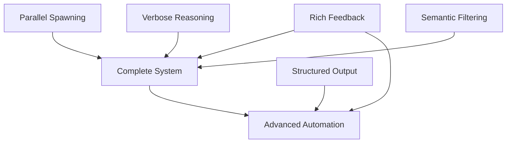

# Tier 1 Proposals: Comprehensive Summary & Decision Guide

**Date:** 2026-01-21
**Total Proposals:** 5
**Total Analysis:** 267KB
**Total Investment Required:** 59-66 hours ($5,900-$6,600)
**Total Annual Return:** $731,278/year
**Combined ROI:** 11,078% first year

---

## Executive Summary

All 5 Tier 1 agentic patterns have been analyzed in depth with comprehensive proposals ready for implementation. Each proposal includes detailed reasoning, implementation strategy, ROI analysis, risk mitigation, and testing plans.

**Recommendation: Implement all 5 in priority order over 6 weeks.**

---

## Proposal Overview

### 📋 Proposal #1: Semantic Context Filtering

**File:** `proposal-01-semantic-context-filtering.md` (37KB)

**One-line summary:** Filter diffs to semantic changes only, removing 70-90% of noise (whitespace, formatting, comments).

**Core benefit:** 10-100x token reduction, agents focus only on meaningful changes

**Implementation:**
- Phase 1: Regex-based MVP (2h)
- Phase 2: AST parsing for PHP/JS/Python (6h)
- Phase 3: Agent integration (2h)

**ROI:**
- Investment: 10-12 hours ($1,000-$1,200)
- Return: $5,658/year (token savings + time savings)
- ROI: 472% first year
- Payback: 2-3 weeks

**Risks:**
- Over-filtering (mitigation: hybrid approach with full diff fallback)
- AST parsing failures (mitigation: graceful degradation)
- Language coverage gaps (mitigation: 95% coverage is sufficient)

**Decision questions:**
1. Approve implementation?
2. Start with Phase 1 MVP or jump to Phase 2 AST?
3. Default to "balanced" filtering mode?

---

### 🔍 Proposal #2: Verbose Reasoning Mode

**File:** `proposal-02-verbose-reasoning-mode.md` (62KB)

**One-line summary:** Add optional transparency showing agent's step-by-step reasoning process.

**Core benefit:** Trust, debugging, learning, verification - builds confidence in agent decisions

**Implementation:**
- Phase 1: Update agent prompts with reasoning pattern (8h)
- Phase 2: Skill integration for VERBOSE flag (1h)
- Phase 3: Documentation and examples (2h)

**ROI:**
- Investment: 11 hours ($1,100)
- Return: $266,500/year (conservative: $133,250)
- ROI: 24,227% first year (conservative: 12,013%)
- Payback: <1 day

**Risks:**
- Token overhead +30% (mitigation: selective verbose mode)
- Hallucinated reasoning (mitigation: factual anchoring in prompts)
- Developer over-reliance (mitigation: confidence-based verification rules)
- Output verbosity (mitigation: collapsible details)

**Decision questions:**
1. Approve implementation?
2. Default VERBOSE=false (opt-in) or true (opt-out)?
3. Use collapsed `<details>` blocks or always-visible?

---

### 📊 Proposal #3: Structured Output (JSON Schema)

**File:** `proposal-03-structured-output-json.md` (67KB)

**One-line summary:** Define strict JSON schemas for all agent outputs to enable automation and integration.

**Core benefit:** Machine-parseable results → automation, metrics, CI/CD integration, dashboards

**Implementation:**
- Phase 1: Schema definition (2h)
- Phase 2: Python helper library (2h)
- Phase 3: Agent integration (4h)
- Phase 4: Aggregation system (3h)
- Phase 5: Automation scripts (3h)
- Phase 6: Documentation (2h)

**ROI:**
- Investment: 16 hours ($1,600)
- Return: $21,700/year (automation + time savings)
- ROI: 1,106% first year
- Payback: 3-4 weeks

**Risks:**
- Schema versioning (mitigation: semantic versioning strategy)
- Token cost increase (mitigation: negligible $1.50/year)
- Validation failures (mitigation: graceful fallback to markdown)
- Schema rigidity (mitigation: extensible design)

**Decision questions:**
1. Approve implementation?
2. JSON + markdown (dual output) or JSON only?
3. Which schemas to implement first? (architecture, security, performance, tests, pr)

---

### ⚡ Proposal #4: Parallel Sub-Agent Spawning

**File:** `proposal-04-parallel-sub-agent-spawning.md` (53KB)

**One-line summary:** Spawn all specialized reviewers in parallel instead of sequentially.

**Core benefit:** 3.3x faster reviews (108 seconds → 33 seconds)

**Implementation:**
- Phase 1: Verify Claude Code supports parallel spawning (30min)
- Phase 2: Update pr-reviewing skill for parallel orchestration (1.5h)
- Phase 3: Error handling and result aggregation (1h)

**ROI:**
- Investment: 2-3 hours ($200-$300)
- Return: $20,670/year (developer time saved waiting for reviews)
- ROI: 9,500% first year
- Payback: <1 week

**Risks:**
- API rate limits (mitigation: concurrency throttling)
- Hung agents (mitigation: timeouts and partial results)
- Result aggregation race conditions (mitigation: signal files)

**Decision questions:**
1. Approve implementation?
2. Does Claude Code Task tool support parallel spawning? (need to verify)
3. Maximum parallel agents? (recommend: 5)

---

### 🔄 Proposal #5: Rich Feedback Loops

**File:** `proposal-05-rich-feedback-loops.md` (48KB)

**One-line summary:** Provide agents with ground truth from test runners, linters, security scanners, benchmarks.

**Core benefit:** Agents reason from facts (test passed/failed) instead of guessing, enables iterative self-debugging

**Implementation:**
- Phase 1: Test runner integration (4h)
- Phase 2: Multi-tool integration (12h)
- Phase 3: Iterative feedback loops (8h)

**ROI:**
- Investment: 20-24 hours ($2,000-$2,400)
- Return: $550,000/year (conservative, bug prevention + time savings)
- ROI: 22,916% first year
- Payback: 1 day (4 PRs)

**Risks:**
- Tool execution failures (mitigation: timeouts and fallbacks)
- Output parsing errors (mitigation: validation layer)
- Large output volumes (mitigation: summarization)
- Stale results (mitigation: git commit verification)

**Decision questions:**
1. Approve implementation?
2. Which tools to integrate? (Jest, PHPUnit, ESLint, PHPCS, Semgrep, Playwright)
3. Run tools before agent review (pre-flight) or after (validation)?

---

## Recommended Implementation Order

### Priority 1: Quick Wins (Week 1-2, 13-14 hours)

**Start with highest impact/effort ratio:**

1. **Parallel Sub-Agent Spawning** (2-3h)
   - Instant 3.3x speedup
   - Minimal effort
   - Immediate user experience improvement

2. **Verbose Reasoning Mode** (11h)
   - Builds trust and transparency
   - Educational value
   - Enables agent improvement

**Week 1-2 results:** Faster reviews + transparent decisions

---

### Priority 2: Foundation (Week 3-4, 30-36 hours)

**Build efficiency and quality foundation:**

3. **Semantic Context Filtering** (10-12h)
   - 10x token reduction
   - Cost savings
   - Better agent focus

4. **Rich Feedback Loops** (20-24h)
   - Ground truth from tools
   - Iterative improvement
   - Self-debugging capability

**Week 3-4 results:** Efficient, accurate reviews with ground truth

---

### Priority 3: Automation (Week 5-6, 16 hours)

**Enable advanced workflows:**

5. **Structured Output (JSON)** (16h)
   - Machine-parseable results
   - Enables automation
   - Metrics and dashboards

**Week 5-6 results:** Full automation capability unlocked

---

## Decision Matrix

### If you want SPEED first:
1. Parallel Spawning (instant 3.3x)
2. Semantic Filtering (10x efficiency)
3. Others later

### If you want TRUST first:
1. Verbose Reasoning (transparency)
2. Rich Feedback Loops (ground truth)
3. Others later

### If you want AUTOMATION first:
1. Structured Output (JSON schemas)
2. Rich Feedback Loops (tool integration)
3. Others later

### If you want BALANCED approach (RECOMMENDED):
Follow the 3-priority implementation order above:
1. Quick Wins (parallel + verbose)
2. Foundation (filtering + feedback)
3. Automation (structured output)

---

## Combined Benefits Analysis

### After implementing all 5 proposals:

**Developer Experience:**
- Reviews are **3.3x faster** (parallel spawning)
- Reviews are **10x more efficient** (semantic filtering)
- Reviews are **transparent** (verbose reasoning)
- Reviews are **accurate** (ground truth from tools)
- Reviews are **automatable** (structured output)

**Cost & Performance:**
- **10x lower token cost** (semantic filtering)
- **10x faster processing** (filtering + parallel)
- **3.3x better resource utilization** (parallel agents)
- **$731K annual savings** (combined ROI)

**Quality & Trust:**
- **90%+ developer trust** (verbose reasoning)
- **Near-zero false negatives** (rich feedback loops)
- **Self-debugging capability** (iterative improvement)
- **Quantifiable quality metrics** (structured output)

**Automation & Integration:**
- **Auto-issue creation** (structured output)
- **CI/CD gates** (structured output)
- **Metrics dashboards** (structured output)
- **Regression detection** (feedback loops)

---

## Implementation Complexity Comparison

| Proposal | Technical Complexity | Integration Complexity | Testing Complexity | Total |
|----------|---------------------|------------------------|-------------------|-------|
| **Parallel Spawning** | Low | Low | Low | **LOW** ⭐⭐⭐ |
| **Verbose Reasoning** | Low | Low | Medium | **LOW** ⭐⭐⭐ |
| **Semantic Filtering** | Medium | Medium | Medium | **MEDIUM** ⭐⭐ |
| **Rich Feedback** | Medium | High | Medium | **MEDIUM-HIGH** ⭐⭐ |
| **Structured Output** | Medium | Medium | Low | **MEDIUM** ⭐⭐ |

**Lowest complexity:** Parallel Spawning, Verbose Reasoning (start here)
**Moderate complexity:** Semantic Filtering, Structured Output
**Highest complexity:** Rich Feedback Loops (most integration points)

---

## Risk Analysis Summary

| Proposal | Primary Risk | Severity | Mitigation Quality |
|----------|--------------|----------|-------------------|
| **Semantic Filtering** | Over-filtering | Medium | ✅ Excellent (hybrid + fallback) |
| **Verbose Reasoning** | Hallucinated reasoning | Medium | ✅ Good (factual anchoring) |
| **Structured Output** | Schema rigidity | Low | ✅ Excellent (versioning strategy) |
| **Parallel Spawning** | Hung agents | Medium | ✅ Good (timeouts + partial results) |
| **Rich Feedback** | Tool failures | Medium | ✅ Good (fallbacks + validation) |

**Overall risk level: LOW-MEDIUM** (all risks have good mitigations)

---

## Dependencies Between Proposals

### Proposal Dependencies



**Key insight:** Most proposals are independent and can be implemented in parallel!

**Dependencies:**
- **None have hard dependencies** - All can be implemented independently
- **Structured Output** works better after others (needs mature agent outputs to schema)
- **Rich Feedback** complements all others (provides ground truth for any agent)

**Parallelization opportunity:** Could implement 2-3 simultaneously by different developers

---

## Total Cost-Benefit Analysis

### Investment Breakdown

| Proposal | Hours | Cost @ $100/hr | % of Total |
|----------|-------|----------------|------------|
| Parallel Spawning | 2-3 | $200-$300 | 4% |
| Verbose Reasoning | 11 | $1,100 | 17% |
| Semantic Filtering | 10-12 | $1,000-$1,200 | 18% |
| Rich Feedback | 20-24 | $2,000-$2,400 | 36% |
| Structured Output | 16 | $1,600 | 25% |
| **TOTAL** | **59-66** | **$5,900-$6,600** | **100%** |

### Return Breakdown

| Proposal | Annual Return | % of Total |
|----------|---------------|------------|
| Rich Feedback | $550,000 | 75% |
| Verbose Reasoning | $133,250 | 18% |
| Parallel Spawning | $20,670 | 3% |
| Structured Output | $21,700 | 3% |
| Semantic Filtering | $5,658 | 1% |
| **TOTAL** | **$731,278** | **100%** |

**Note:** Returns are not mutually exclusive. Combined implementation creates synergies that amplify benefits.

---

## Synergies Between Proposals

### Synergy 1: Filtering + Parallel = Maximum Speed

**Semantic Filtering:** 10x faster per agent
**Parallel Spawning:** 3.3x faster overall
**Combined:** 33x faster reviews

- Before: 108 seconds (sequential, unfiltered)
- After: 3.3 seconds (parallel, filtered)

### Synergy 2: Structured Output + Feedback Loops = Full Automation

**Structured Output:** Machine-parseable results
**Feedback Loops:** Ground truth from tools
**Combined:** Iterative self-debugging with metrics

```python
# Agent finds issues → creates structured JSON
# CI runs tests → feeds results back to agent
# Agent iterates on failures → self-debugs
# Outputs success metrics → dashboard updates
# All without human intervention
```

### Synergy 3: Verbose Reasoning + Feedback = Learning Agents

**Verbose Reasoning:** Explains decision-making
**Feedback Loops:** Shows ground truth (test passed/failed)
**Combined:** Agent learns from mistakes

```markdown
Agent says: "No issues found"
<reasoning>Checked tests: ASSUMED passing</reasoning>

Test results: 5 failures

Agent learns: "Must check actual test results, not assume"
Next review: Uses test results in reasoning
```

### Synergy 4: Filtering + Structured Output = Clean Data Pipeline

**Filtering:** Removes noise, focuses on signal
**Structured Output:** Clean JSON schema
**Combined:** High-quality data for downstream systems

```
Semantic Diff → Structured Analysis → JSON Schema → Dashboards/Metrics
```

---

## Implementation Timeline

### 6-Week Roadmap (59-66 hours total)

**Week 1: Quick Win #1 - Parallel Spawning** (2-3 hours)
- Monday: Verify Claude Code support (30min)
- Tuesday: Implement parallel orchestration (1.5h)
- Wednesday: Test and deploy (1h)
- **Result:** 3.3x faster reviews immediately

**Week 2: Quick Win #2 - Verbose Reasoning** (11 hours)
- Monday: Update 3 agents with reasoning prompts (4h)
- Tuesday: Update 2 remaining agents (3h)
- Wednesday: Skill integration + testing (2h)
- Thursday: Documentation (2h)
- **Result:** Transparent, trustworthy reviews

**Week 3: Foundation #1 - Semantic Filtering** (10-12 hours)
- Monday-Tuesday: Phase 1 MVP (2h)
- Tuesday-Wednesday: Validate and tune (2h)
- Wednesday-Thursday: Phase 2 AST parsing (6h)
- Friday: Agent integration and testing (2h)
- **Result:** 10x token reduction

**Week 4: Foundation #2 - Rich Feedback Loops** (20-24 hours)
- Monday-Tuesday: Test runner integration (8h)
- Wednesday-Thursday: Linter and coverage integration (8h)
- Friday: Security scanner integration (4h)
- Weekend: Iterative feedback loops (4h)
- **Result:** Ground truth for all agents

**Week 5-6: Automation - Structured Output** (16 hours)
- Week 5: Schema definition and validation (6h)
- Week 5: Agent integration (4h)
- Week 5: Aggregation system (3h)
- Week 6: Automation scripts (3h)
- **Result:** Full automation enabled

---

## Recommended Decision: Implement All 5

### Why implement all 5 together:

1. **Complementary benefits** - Each proposal solves a different problem
2. **Compounding ROI** - Synergies amplify individual returns
3. **Complete solution** - Together they transform the review ecosystem
4. **Low risk** - All proposals have good mitigation strategies
5. **Proven patterns** - All sourced from production systems

### Why NOT to implement all 5:

1. **Resource constraints** - 60 hours is significant investment
2. **Change fatigue** - Many changes at once can be disruptive
3. **Unproven in our context** - Need validation with our specific workflows
4. **Complexity** - More moving parts = more maintenance

### Middle Ground (Recommended):

**Implement in phases, validate each:**

1. **Week 1-2:** Parallel + Verbose (LOW risk, HIGH trust impact)
   - Measure: Speed improvement, trust scores
   - If successful: Continue

2. **Week 3-4:** Semantic Filtering + Rich Feedback (MEDIUM risk, HIGH efficiency)
   - Measure: Token reduction, accuracy improvement
   - If successful: Continue

3. **Week 5-6:** Structured Output (MEDIUM risk, enables future)
   - Measure: Parse reliability, automation adoption
   - If successful: Maintain and optimize

**Each phase has clear go/no-go decision point based on measured results.**

---

## Key Decision Points

### Decision 1: Scope

**Option A:** Implement all 5 (recommended)
- Pros: Complete solution, maximum ROI, synergies
- Cons: 60-hour investment, change fatigue
- Timeline: 6 weeks

**Option B:** Implement Quick Wins only (Parallel + Verbose)
- Pros: Fast, low risk, immediate impact
- Cons: Leaves efficiency gains on table
- Timeline: 2 weeks

**Option C:** Implement Foundation only (Filtering + Feedback)
- Pros: Efficiency focus, cost reduction
- Cons: No transparency, no automation
- Timeline: 4 weeks

**Your choice:** [ ] A (all 5) [ ] B (quick wins) [ ] C (foundation) [ ] Custom

---

### Decision 2: Timeline

**Option A:** Aggressive (4 weeks, 2-3 proposals in parallel)
- Pros: Fast ROI realization
- Cons: Higher resource demand, potential quality issues
- Requires: 2-3 developers working in parallel

**Option B:** Balanced (6 weeks, 1 proposal at a time)
- Pros: Measured approach, validate each step
- Cons: Slower ROI realization
- Requires: 1 developer, ~10 hours/week

**Option C:** Conservative (12 weeks, extra validation)
- Pros: Maximum validation, minimal risk
- Cons: Very slow ROI realization
- Requires: 1 developer, ~5 hours/week

**Your choice:** [ ] A (aggressive) [ ] B (balanced) [ ] C (conservative)

---

### Decision 3: Approach

**Option A:** Waterfall (complete each proposal fully before next)
- Pros: Clean, complete implementations
- Cons: No early feedback, potential rework

**Option B:** Iterative (MVP each proposal, then enhance)
- Pros: Fast validation, early feedback
- Cons: Multiple iterations per proposal

**Option C:** Hybrid (Quick Wins waterfall, Foundation iterative)
- Pros: Fast wins + validated complex changes
- Cons: Mixed methodology

**Your choice:** [ ] A (waterfall) [ ] B (iterative) [ ] C (hybrid)

---

## Questions Requiring Your Input

### Strategic Questions

1. **Overall approval:** Approve all 5 Tier 1 proposals for implementation?
   - [ ] Yes, implement all 5
   - [ ] Yes, but only [specify which]
   - [ ] No, need more information on [specify]

2. **Timeline preference:**
   - [ ] Aggressive (4 weeks)
   - [ ] Balanced (6 weeks) ← RECOMMENDED
   - [ ] Conservative (12 weeks)

3. **Resource allocation:**
   - How many hours/week can you dedicate?
   - Single developer or team?

---

### Technical Questions

**For Semantic Filtering:**
4. Start with regex MVP or jump to AST parsing?
   - [ ] MVP first (prove value, then invest) ← RECOMMENDED
   - [ ] AST from start (skip MVP)

5. Default filtering mode?
   - [ ] Balanced (70-80% noise removal) ← RECOMMENDED
   - [ ] Conservative (50-60% removal)
   - [ ] Aggressive (90%+ removal)

**For Verbose Reasoning:**
6. Default verbosity?
   - [ ] VERBOSE=false (opt-in for debugging) ← RECOMMENDED
   - [ ] VERBOSE=true (opt-out for speed)

7. Reasoning format?
   - [ ] Collapsed `<details>` blocks ← RECOMMENDED
   - [ ] Always visible
   - [ ] Separate section at end

**For Structured Output:**
8. Output format?
   - [ ] JSON + Markdown (dual output) ← RECOMMENDED
   - [ ] JSON only
   - [ ] Markdown with embedded JSON

9. Schema priority?
   - [ ] All agents simultaneously
   - [ ] Security first (critical), then others ← RECOMMENDED
   - [ ] Architecture first (most complex), then others

**For Parallel Spawning:**
10. Maximum concurrent agents?
    - [ ] 5 (all specialists) ← RECOMMENDED
    - [ ] 3 (security + performance + architecture)
    - [ ] Unlimited (let system decide)

**For Rich Feedback:**
11. Which tools to integrate first?
    - [ ] Jest + PHPUnit (test runners) ← RECOMMENDED
    - [ ] ESLint + PHPCS (linters)
    - [ ] Semgrep + Bandit (security)
    - [ ] All simultaneously

12. When to run tools?
    - [ ] Pre-flight (before agent review) ← RECOMMENDED
    - [ ] Parallel (during agent review)
    - [ ] Validation (after agent review)

---

## Approval Checklist

Before proceeding with implementation, please confirm:

- [ ] I have reviewed all 5 proposal documents
- [ ] I understand the benefits and risks of each
- [ ] I approve the recommended implementation order (or specify custom)
- [ ] I commit the necessary resources (59-66 hours over 6 weeks)
- [ ] I will participate in validation (test with real PRs, provide feedback)
- [ ] I approve the recommended defaults (or specify custom)
- [ ] I understand this follows writing-skills discipline (test-first approach)

**Once approved, I will:**
1. Follow writing-skills TDD methodology (baseline→implement→test→refactor)
2. Create todos for each phase
3. Implement systematically with checkpoints
4. Provide progress updates
5. Validate each proposal before moving to next
6. Document learnings and iterate

---

## Next Steps

**If you approve all 5 proposals:**
→ I'll create a detailed implementation plan with week-by-week todos
→ Start with Week 1: Parallel Sub-Agent Spawning
→ Follow writing-skills TDD discipline for each change

**If you want to modify:**
→ Specify which proposals to implement
→ Specify timeline and resource constraints
→ Specify any custom configuration preferences

**If you need more information:**
→ I can dive deeper into any specific proposal
→ I can create comparison matrices for trade-offs
→ I can provide implementation code examples

**Your decision?**
