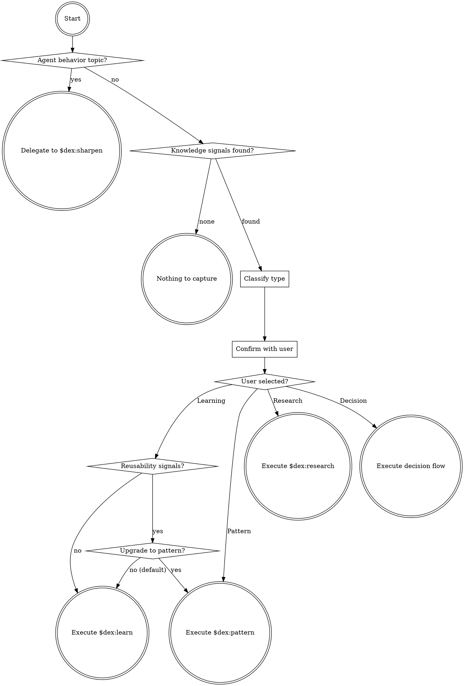

<!-- GENERATED FILE - DO NOT EDIT -->
<!-- Source: ./commands/grok.md -->

## Codex Host Adapter

This skill is generated from the canonical Claude Code command named above. To execute it in Codex:

1. Treat the text supplied after the skill mention as the invocation arguments. Substitute that exact text for `${CODEX_SKILL_ARGUMENTS}` before executing shell commands.
2. Resolve `CODEX_PLUGIN_ROOT` to the absolute plugin root. The loaded skill directory is `<plugin-root>/codex-skills/<skill-name>`, so the plugin root is two directories above the directory containing this `SKILL.md`.
3. Assign both variables explicitly in any shell call that uses them. Codex does not export these instruction variables automatically.
4. Use Codex's available user-input and subagent tools when the workflow requests them.
5. Follow the canonical workflow below without skipping its gates or artifact checks.

## Canonical Workflow

# $dex:grok

Deeply understand the current conversation, classify the knowledge, and delegate to the right capture flow. This command asks one question, then hands off - keep it fast.

## Step 1: Classify

If the conversation is primarily about agent behavior (wrong tools, inefficient discovery, missed shortcuts), route to `$dex:sharpen` instead. Grok captures domain knowledge; sharpen captures operational knowledge.

Scan the recent conversation for knowledge signals - surprises, mistakes, trade-off discussions, repeated friction, or investigation results - and classify into one of these categories:

| Category | Signal in conversation |
|---|---|
| **Learning** | A discovery, fix, gotcha, or debugging insight - something went wrong or was non-obvious |
| **Pattern** | A reusable approach, convention, or anti-pattern - something that should be repeated (or avoided) |
| **Decision** | A choice between alternatives with trade-offs discussed - "we chose X because Y" |
| **Research** | Extensive investigation, multiple approaches tried, trial-and-error exploration, empirical findings across environments |

If `${CODEX_SKILL_ARGUMENTS}` contains a focus hint (e.g., "cache invalidation"), narrow the extraction to that topic.

If the conversation contains no knowledge worth capturing (routine operations, pure Q&A, nothing surprising or non-obvious), say so briefly and stop. Do not force-classify when there is nothing to classify.

If the conversation contains multiple knowledge types, pick the most prominent one. Disambiguation heuristics:
- **Learning vs. Pattern:** default to learning. Only auto-classify as pattern when the insight is purely a convention or approach with no discovery element (rare - most insights start as learnings).
- **Learning vs. Research:** pick learning if one key insight; pick research if multiple approaches were tried across environments and findings are empirical.
- **Pattern vs. Decision:** pick pattern if the knowledge prescribes HOW to do something; pick decision if it explains WHY one option was chosen over alternatives.

The user can override via the confirmation step.

## Step 2: Confirm Classification

Use the host's user-input mechanism:

**Question:** "What kind of knowledge to capture?"

Show in the question description:
> **Detected:** [1-sentence summary of the knowledge signal found]

**Options:**
- **Learning** - something you just discovered or fixed
- **Pattern** - a reusable approach or convention
- **Decision** - a choice with trade-offs worth remembering
- **Research** - extensive investigation with empirical findings

Always show all four options. Mark only the auto-classified one as "(Recommended)".

## Step 3: Graduation Check

If the user selected Learning, check for reusability signals:
- Describes an approach that applies beyond the original situation
- Contains "always", "never", "prefer", or convention language
- Could benefit from explicit alternatives (conditions where a different approach is better)

If reusability signals are present, use the host's user-input mechanism:

**Question:** "This insight looks reusable. Capture as a pattern with applicability boundaries?"

**Options:**
- **No, keep as learning (Recommended)** - captures as-is
- **Yes, upgrade to pattern** - adds Alternatives and When to apply sections

If "Yes", delegate to `$dex:pattern` flow. Otherwise continue with `$dex:learn`.

## Step 4: Delegate

Based on the user's selection:

- **Learning** → Execute the full `$dex:learn` flow
- **Pattern** → Execute the full `$dex:pattern` flow
- **Decision** → Execute the `$dex:learn` flow with these overrides: use the **Decision Format** from the `knowledge-capture` skill, write to `.claude/docs/decisions/`, and skip the promotion step (decisions are reference material, not rules)
- **Research** → Execute the full `$dex:research` flow
