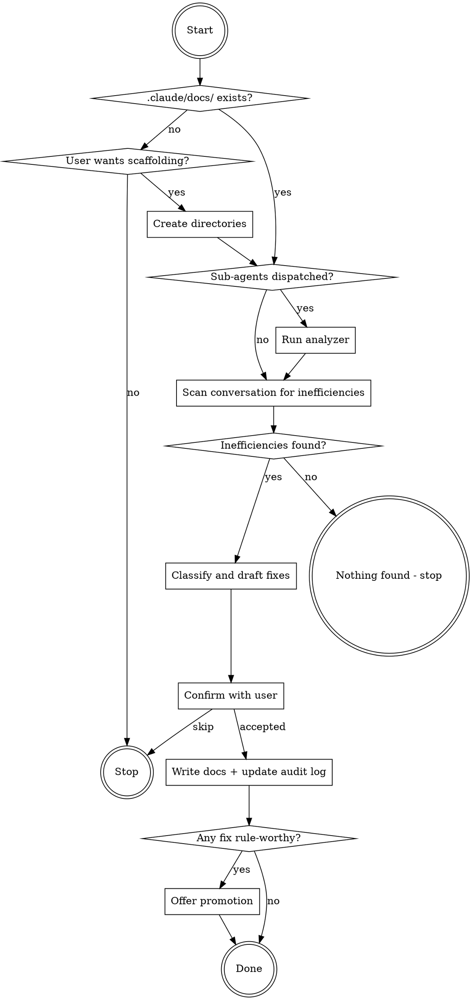

<!-- GENERATED FILE - DO NOT EDIT -->
<!-- Source: ./commands/sharpen.md -->

## Codex Host Adapter

This skill is generated from the canonical Claude Code command named above. To execute it in Codex:

1. Treat the text supplied after the skill mention as the invocation arguments. Substitute that exact text for `${CODEX_SKILL_ARGUMENTS}` before executing shell commands.
2. Resolve `CODEX_PLUGIN_ROOT` to the absolute plugin root. The loaded skill directory is `<plugin-root>/codex-skills/<skill-name>`, so the plugin root is two directories above the directory containing this `SKILL.md`.
3. Assign both variables explicitly in any shell call that uses them. Codex does not export these instruction variables automatically.
4. Use Codex's available user-input and subagent tools when the workflow requests them.
5. Follow the canonical workflow below without skipping its gates or artifact checks.

## Canonical Workflow


# $dex:sharpen

Analyze agent behavior in the current conversation, find inefficiencies, and capture concrete fixes as project knowledge. This is an operational extraction strategy - it captures how the agent should work, not domain knowledge about the codebase.



## Step 1: Discover Project Infrastructure

Follow the **Project Discovery** steps from the `knowledge-capture` skill.

If `.claude/docs/` does not exist, use the host's user-input mechanism:

**Question:** "No knowledge directory found. Create it?"
**Options:**
- **Yes, create `.claude/docs/`** - scaffolds `learnings/`, `patterns/`, `decisions/`, `research/`
- **Not now** - abort capture

If "Not now", stop here. If "Yes", create directories with `mkdir -p` and continue.

## Step 2: Analyze Sub-Agent Behavior

If sub-agents were dispatched in this session (via Task tool), run the analyzer:

```bash
python3 ${CODEX_PLUGIN_ROOT}/scripts/analyze-subagents.py --project-dir $(git rev-parse --show-toplevel)
```

Verify that `${CODEX_PLUGIN_ROOT}/scripts/analyze-subagents.py` exists before running. If the script is missing, skip this step and continue with Step 3.

If the script exits with code 2 (no data), skip this step. If exit code 0, incorporate
flagged patterns into Step 3's analysis - they map to Inefficiency Categories:
- `BASH_FOR_FILES` - Wrong tool usage
- `HIGH_TOOL_COUNT` / `BASH_HEAVY` - Inefficient discovery
- `REPEATED_READS` - Over-broad scope
- `HIGH_TOKEN_USAGE` - Over-broad scope
- `FAILED_TOOLS` - Incorrect assumptions

## Step 3: Analyze Agent Behavior

Before scanning, read `.claude/docs/.sharpen-log.md` if it exists - this is the audit log of previously captured findings. Also check `.claude/docs/` for existing documents tagged `agent-efficiency`. Skip inefficiencies already captured in the audit log or existing documents.

Scan the conversation history **and the sub-agent analysis from Step 2 (if available)** for inefficiencies using the **Inefficiency Categories** from the `knowledge-capture` skill. Focus on moments that cost significant time or tokens - minor suboptimal choices (e.g., reading 10 extra lines of a file) are normal exploration, not inefficiencies worth capturing.

If `${CODEX_SKILL_ARGUMENTS}` contains a focus hint, narrow the analysis to that area.

Hint: The highest-value inefficiencies are ones that would recur in future sessions without a fix. A one-time wrong guess is noise; a systematic pattern of wrong guesses is signal.

For each inefficiency found, note:
1. **What happened** - the specific moment of waste
2. **What should have happened** - the efficient alternative
3. **Why** - the missing knowledge that caused the inefficiency

If no inefficiencies are found or everything found is minor/one-time, say so briefly and stop. Do not force-find problems where none exist.

## Step 4: Classify Root Cause and Draft Fix

For each inefficiency, use the **Root Cause Classification** from the `knowledge-capture` skill to determine the output type.

Draft the fix using the appropriate document format from the `knowledge-capture` skill:
- **Learning Format** - for missing knowledge, debugging insights, skill gaps
- **Pattern Format** - for missing reusable workflows or approaches

Every drafted fix must pass the standard four quality checks AND the three **Sharpen Extraction Quality** checks from the `knowledge-capture` skill.

<example type="CORRECT" label="agent-operational fix">
# Use Glob instead of find for file discovery in this project

Tags: agent-efficiency, tool-usage, file-discovery

## Rule

Use Glob tool with patterns like `**/*.php` instead of Bash `find` commands.
Glob is faster, returns sorted results, and the project CLAUDE.md already
specifies this preference.
</example>

<example type="INCORRECT" label="domain knowledge, not operational">
# File discovery

**Tags:** tools

## Rule

Sometimes find doesn't work well. Try using other tools.
</example>

The correct example demonstrates all three sharpen quality checks: agent-operational, preventive, specific.

Tag all sharpen-originated documents with `agent-efficiency` plus domain-specific tags. Tag skill gap fixes additionally with `skill-improvement`.

## Step 5: Confirm with User

Use the host's user-input mechanism to present all findings at once.

**Question:** "Capture these agent efficiency fixes?"

For each fix, show in the question description:
> **Inefficiency:** [1-sentence summary of what went wrong]
> **Fix title:** [drafted title]
> **Root cause:** [classification from Root Cause table]
> **File:** `.claude/docs/learnings/YYYY-MM-DD-slug.md` (or `patterns/`)

If multiple fixes were found, present them all. Number each fix.

**Options:**
- **Accept all** - write all documents immediately
- **Edit** - let user provide corrections via free text
- **Skip** - abort capture

If "Edit", apply corrections and confirm again. If "Skip", stop here.

## Step 6: Write the Documents and Update Audit Log

Write each confirmed fix to the appropriate `.claude/docs/` subdirectory using the document format from the `knowledge-capture` skill.

Report each file written:
```
Captured: .claude/docs/learnings/YYYY-MM-DD-slug.md
Captured: .claude/docs/patterns/YYYY-MM-DD-slug.md
```

After writing, append an entry to `.claude/docs/.sharpen-log.md` for each captured fix, following the **Sharpen Audit Log** format from the `knowledge-capture` skill. Create the file if it does not exist.

## Step 7: Suggest Promotion (Conditional)

For each captured document, evaluate whether it looks rule-worthy (per the **When to Suggest Promotion** criteria in the `knowledge-capture` skill): does it contain a do/don't directive that corrects a recurring agent mistake, or apply project-wide?

**If rule-worthy**, use the host's user-input mechanism:

**Question:** "Some fixes look like project rules. Add one-liners to CLAUDE.md?"

Show which fixes are promotion candidates. The user confirms or declines per fix.

**If NO fix is rule-worthy**, skip this step silently. Proceed to completion.

## Step 8: Promote (If Selected)

Follow the **CLAUDE.md Promotion** flow from the `knowledge-capture` skill:

1. Count CLAUDE.md lines and check budget
2. Draft a one-liner + link for each accepted promotion
3. Auto-place in the most relevant section
4. Report success with new line count

After promotion (or skipping it), stop.
