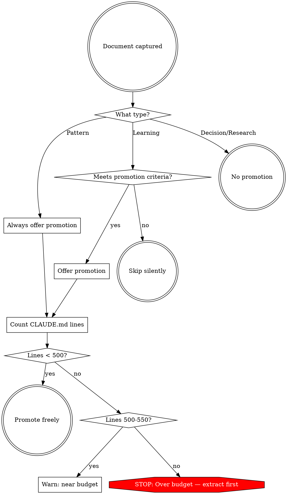

# Knowledge Capture Skill

Shared logic for all `/dex:*` commands. Follow these procedures exactly — do what the calling command asks, nothing more.

## Project Discovery

Discover the project's knowledge infrastructure fresh on every invocation. Scan the filesystem directly — no config files, no cached state.

### Discovery Steps

1. **Find the project root:** Run `git rev-parse --show-toplevel`
2. **Find CLAUDE.md:** Check in order, use the first found:
   - `<root>/CLAUDE.md`
   - `<root>/.claude/CLAUDE.md`
3. **Resolve instructions file and `ai_dir`:**
   a. Check whether CLAUDE.md redirects to AGENTS.md:
      - **Symlink:** Run `readlink <claude_md_path>`. If the target filename is `AGENTS.md`, use the symlink target.
      - **Include directive:** Read the file content. If the entire content is a single `@AGENTS.md` line (with optional whitespace/newlines), find the referenced AGENTS.md relative to CLAUDE.md's directory.
      - If no indirection is detected, continue using CLAUDE.md.
   b. Derive `ai_dir` from the resolved instructions file:
      - CLAUDE.md → `ai_dir` = `.claude`
      - AGENTS.md → `ai_dir` = `.ai`
4. **Find knowledge directory:** Check for `<root>/<ai_dir>/docs/`
   - **Migration check:** If `ai_dir` is `.ai` but `<root>/.ai/docs/` does not exist and `<root>/.claude/docs/` does exist, flag a migration mismatch. Use `.claude/docs/` as the active knowledge directory for now, but record the mismatch for `init` and `status` to surface.
5. **List existing subdirectories:** Check for `learnings/`, `patterns/`, `decisions/`, `research/` within the knowledge directory
6. **Count lines:** Run `wc -l` on the resolved instructions file

If a CLAUDE.md or `.claude/docs/` does not exist, proceed with what you have. Missing infrastructure is a normal state — handle it per the calling command's instructions.

### Discovery Output

Build this mental model before proceeding:

```
project_root:       /path/to/project
instructions_file:  /path/to/project/CLAUDE.md  (387 lines)
ai_dir:             .claude
knowledge_dir:      /path/to/project/.claude/docs/
  learnings:        exists (7 files)
  patterns:         exists (3 files)
  decisions:        exists (2 files)
  research:         exists (1 file)
```

If AGENTS.md indirection was resolved:

```
project_root:       /path/to/project
instructions_file:  /path/to/project/AGENTS.md  (387 lines, resolved from CLAUDE.md)
ai_dir:             .ai
knowledge_dir:      /path/to/project/.ai/docs/
  learnings:        exists (7 files)
  patterns:         exists (3 files)
  decisions:        exists (2 files)
  research:         exists (1 file)
```

If migration mismatch was detected (AGENTS.md + existing `.claude/docs/`):

```
project_root:       /path/to/project
instructions_file:  /path/to/project/AGENTS.md  (387 lines, resolved from CLAUDE.md)
ai_dir:             .ai
knowledge_dir:      /path/to/project/.claude/docs/  (migration available → .ai/docs/)
  learnings:        exists (7 files)
  patterns:         exists (3 files)
  decisions:        exists (2 files)
  research:         exists (1 file)
```

### Variable Substitution

Throughout this skill and all `/dex:*` commands:
- "CLAUDE.md" refers to the resolved instructions file (CLAUDE.md or AGENTS.md)
- `.claude/` and `.claude/docs/` refer to the resolved `ai_dir` (`<ai_dir>/` and `<ai_dir>/docs/`)

Substitute the resolved values in all paths and user-facing messages. For example, when `ai_dir` is `.ai`: "Promote to AGENTS.md?", "Create `.ai/docs/`?", scaffolding creates `.ai/docs/learnings/` etc.

If `.claude/docs/` doesn't exist, commands should offer scaffolding via AskUserQuestion before proceeding (except `/dex:status` which reports the absence).

### Scaffolding

When scaffolding is needed, create these directories:
- `.claude/docs/learnings/`
- `.claude/docs/patterns/`
- `.claude/docs/decisions/`
- `.claude/docs/research/`

Create empty directories only. No README files, no templates, no boilerplate.

## Document Formats

All documents are **agent-first**: the first section contains the actionable directive — an AI agent reading only the Rule/Pattern/Decision section gets enough to act. Context and examples follow for depth.

### Token Efficiency

These docs are consumed by AI agents, not read by humans. Every formatting choice must earn its tokens:

- **Bare paths over markdown links** — `Details: path/to/file.md` not `[details](path/to/file.md)`. Agents don't click links.
- **Plain metadata** — `Date: 2026-02-13` not `**Date:** 2026-02-13`. Bold markers serve human eyes only.
- **Direct file:line references** — `src/gateway.php:45` not "see the gateway file". Include line numbers when relevant.
- **No prose filler** — omit transitions, summaries of what follows, and empty template sections.

### Learning Format

Use for: discoveries, fixes, gotchas, debugging insights, non-obvious behaviors.

```markdown
# Short directive title

Date: YYYY-MM-DD
Tags: tag1, tag2, tag3

## Rule

The actionable directive — what to do or not do. An agent reading
only this section should know enough to apply the knowledge.

## Context

Why this matters. What went wrong or what was non-obvious.
Technical explanation of the root cause.

## Examples

Code examples showing correct and incorrect approaches.
Use CORRECT / WRONG labels for clarity.
```

<example type="CORRECT">
# Always pass --user=1 for WP-CLI REST calls with auth

Date: 2026-02-13
Tags: wp-cli, rest-api, authentication

## Rule

Always pass `--user=1` when making WP-CLI REST API calls that have
permission callbacks. Without it, the call runs as unauthenticated.
</example>

<example type="INCORRECT">
# WP-CLI REST API Issue

Today I discovered that WP-CLI REST API calls need authentication.
This was really confusing and took a while to debug. The error was a 403...
</example>

### Pattern Format

Use for: reusable approaches, conventions, anti-patterns, recurring solutions.

```markdown
# Short pattern name

Date: YYYY-MM-DD
Tags: tag1, tag2, tag3

## Pattern

The reusable approach — what it is and how to apply it.

## When to apply

- Condition 1
- Condition 2

## Alternatives

- When [condition 1], prefer [alternative approach] instead
- When [condition 2], [simpler method] works better because [reason]

## Reference implementation

Direct file:line reference (e.g., `src/gateway.php:45-60`), or inline code example.
```

### Decision Format

Use for: architectural choices, trade-off decisions, technology selections.

```markdown
# Short decision statement

Date: YYYY-MM-DD
Tags: tag1, tag2, tag3

## Decision

What was chosen and the one-line rationale.

## Alternatives considered

- Option A: Description — why rejected
- Option B (chosen): Description — why chosen
- Option C: Description — why rejected

## Why this choice

Detailed reasoning, trade-offs, and constraints that led to this choice.
```

### Research Format

Use for: extensive investigations, multi-hour debugging sessions, API explorations, trial-and-error findings across environments.

```markdown
# Short title describing what was researched

Date: YYYY-MM-DD
Tags: tag1, tag2, tag3
Environment: key versions, OS, configs that matter
Status: current

## Summary
2-3 sentence overview of key findings for quick scanning.

## What Works
Proven approaches with evidence (commands, configs, code).

## What Doesn't Work
Failed approaches and WHY they failed.

## Key Findings
Detailed empirical observations, numbered for reference.

## Reproduction Steps
How to verify or reproduce the findings.

## Open Questions
Unresolved issues or areas needing further investigation.
```

Key differences from Learning:
- `Environment` field — versions, OS, configs for assessing relevance over time
- `Status` field — `current` / `outdated` / `superseded` for freshness tracking
- No line limit (but every section must earn its place — omit empty sections)
- No CLAUDE.md promotion (reference material, not rules)

<example type="CORRECT">
# PHP 8.3 readonly property behavior with WooCommerce hooks

Date: 2026-02-15
Tags: php-8.3, readonly, woocommerce, hooks
Environment: PHP 8.3.4, WooCommerce 9.6.0, WordPress 6.7
Status: current

## Summary
PHP 8.3 readonly properties cannot be re-initialized after clone. WooCommerce
hook callbacks that clone objects hit fatal errors with readonly properties.

## What Works
Use backed enums or private properties with getters instead of readonly.

## What Doesn't Work
- `clone $order` with readonly properties → Fatal error
- Reflection-based workaround → works but fragile across PHP versions
</example>

<example type="INCORRECT">
# PHP research

Today I spent a few hours looking into PHP 8.3. I tried a bunch of
things and some worked and some didn't. Here's what I found...
</example>

### Filename Convention

All files follow: `YYYY-MM-DD-slug.md`

Slug rules:
- Lowercase
- Replace spaces with hyphens
- Remove special characters except hyphens
- Truncate to keep full path under 100 characters

## CLAUDE.md Promotion

### When to Suggest Promotion



**Graduation flow**: `/dex:grok` may offer to upgrade a learning to a pattern when reusability signals are detected. Delegates to `/dex:pattern` for Alternatives and When to apply sections.

**Learning promotion criteria** — at least one:
- Contains a do/don't directive that corrects a common mistake
- Addresses a recurring issue mentioned multiple times in conversation
- Is a project-wide constraint that applies broadly, not to one file

**Skip promotion silently** for informational learnings, one-off debugging insights, decisions, and research.

**Budget 500–550**: Warn via AskUserQuestion — "CLAUDE.md is at X/500 lines." Options: "Add anyway" / "Extract a section first"

**Budget 550+**: Hard block. Tell user to extract sections first. Show sections ranked by line count, offer to extract largest. Proceed only after extraction brings count below 550.

### Promoted Rule Format

One-liner + bare path to the source document:

```markdown
- Always pass `--user=1` for WP-CLI REST calls with auth. Details: .claude/docs/learnings/2026-02-13-wp-cli-rest-auth.md
```

<example type="CORRECT" label="bare path saves tokens">
- Always pass `--user=1` for WP-CLI REST calls with auth. Details: .claude/docs/learnings/2026-02-13-wp-cli-rest-auth.md
</example>

<example type="INCORRECT" label="redundant markdown link wastes tokens">
- Always pass `--user=1` for WP-CLI REST calls with auth. See [details](.claude/docs/learnings/2026-02-13-wp-cli-rest-auth.md).
</example>

### Auto-Placement

When promoting a rule to CLAUDE.md:

1. Read CLAUDE.md and identify all `##` section headings
2. Match the rule's tags and topic against section headings and content to find the most relevant section
3. Append the one-liner at the end of that section (before the next `##` heading)
4. If no section is a clear match, append under the last section

### Extraction Flow

When extracting a section from CLAUDE.md:

1. List all `##` sections with their line counts
2. AskUserQuestion: "Which section to extract?" — show sections ranked by size
3. Move the section content to `.claude/docs/` as a standalone doc
4. Replace the section in CLAUDE.md with a 1-2 line summary + bare path:
   ```markdown
   ## Section Name
   Full details: .claude/docs/section-name.md
   ```
5. Report the new line count

## Knowledge Extraction from Conversation

### How to Extract

Before drafting, analyze the relevant conversation exchange:

<pre_extraction_analysis>
- What type of insight is this? (rule, approach, choice, or investigation)
- What triggered the discovery? (error, surprise, repeated friction)
- What behavioral change should result? (do X instead of Y, always check Z)
</pre_extraction_analysis>

Then draft:

1. **Title** — short directive statement (imperative or declarative)
2. **Key section** — Rule for learnings, Pattern for patterns, Decision for decisions, Summary for research
3. **Tags** — 3-5 from the technical domain (lowercase, hyphen-separated)
4. **Present via AskUserQuestion** for confirmation

Focus on what an agent needs to act differently next time, not on narrating what happened during debugging.

### Extraction Quality

Before saving any document, verify it passes all four checks. If any check fails, revise before saving.

<extraction_quality_checklist>
- Self-contained: an agent reading this in isolation knows what to do
- Actionable: tells the agent what to DO, not what happened
- Specific: includes concrete examples, file paths, or code
- Concise: under 50 lines (learnings), under 80 (patterns/decisions). Research: no limit but omit empty sections
</extraction_quality_checklist>

## Agent Behavior Analysis

Shared logic for analyzing agent behavior in a conversation to find inefficiencies and capture fixes as project knowledge. Used by `/dex:sharpen`.

### Inefficiency Categories

Scan the conversation for these categories of wasted effort:

| Category | What to look for |
|----------|-----------------|
| Wrong tool usage | Used Bash when Grep/Glob/Read was better; used `find` instead of Glob; used `cat` instead of Read |
| Inefficient discovery | Took 5+ searches to find something findable in 1-2; didn't use IDE index tools when available |
| Missed shortcuts | Didn't leverage existing project scripts, aliases, or conventions documented in CLAUDE.md |
| Rediscovering known info | Debugged something already documented in CLAUDE.md or `.claude/docs/` |
| Incorrect assumptions | Assumed wrong file structure, API shape, or convention — then had to backtrack |
| Unnecessary confirmation loops | Asked the user things that could be inferred from context or existing docs |
| Over-broad scope | Read entire files when only a section was needed; searched too widely before narrowing |

Flag only inefficiencies that meet **both** criteria:
1. Cost significant time or tokens (multiple wasted tool calls, 3+ minutes of backtracking)
2. Would likely recur in future sessions without a fix

Skip: one-time wrong guesses, normal exploration overhead, reasonable first attempts that didn't pan out.

For each flagged inefficiency, note three things:
1. **What happened** — the specific moment of waste
2. **What should have happened** — the efficient alternative
3. **Why** — the missing knowledge that caused the inefficiency

### Root Cause Classification

Map each identified inefficiency to its fix destination:

| Root cause | Output destination |
|-----------|-------------------|
| Missing rule (do/don't directive) | CLAUDE.md promotion candidate |
| Missing knowledge (debugging insight, gotcha) | `.claude/docs/learnings/` |
| Missing approach (reusable workflow) | `.claude/docs/patterns/` |
| Skill gap (agent needs better instructions) | `.claude/docs/learnings/` tagged `skill-improvement` |

### Sharpen Extraction Quality

Apply the standard extraction quality checklist (self-contained, actionable, specific, concise) PLUS these three additional checks:

1. **Agent-operational** — focuses on how the agent should work, not domain knowledge about the codebase
2. **Preventive** — tells the agent what to do *before* hitting the inefficiency, not how to recover after
3. **Non-obvious** — captures project-specific knowledge an agent wouldn't discover without experience (e.g., "this project's test runner requires --user=1" qualifies; generic tool preferences do not)

<example type="CORRECT" label="agent-operational">
Rule: "In this project, always use `pnpm wp --user=1` for REST API calls in WP-CLI"

Agent-operational: tells the agent how to run commands in this project.
Preventive: specifies what to do before making the call.
Non-obvious: project-specific pnpm wrapper isn't discoverable without experience.
</example>

<example type="INCORRECT" label="domain knowledge — use /dex:learn instead">
Rule: "The REST API returns 403 when permissions are missing"

This is domain knowledge (how WordPress works), not operational knowledge
(how the agent should work). Capture via `/dex:learn` instead.
</example>

### Sharpen Audit Log

Running log at `.claude/docs/.sharpen-log.md` that tracks efficiency fixes across sessions. Used by `/dex:sharpen` to avoid duplicating previously captured knowledge.

#### Audit Log Format

```markdown
# Sharpen Audit Log

## YYYY-MM-DD

- [category]: [1-sentence summary] → [file path]
- [category]: [1-sentence summary] → [file path]
```

#### Reading the Audit Log

Before analyzing, read `.claude/docs/.sharpen-log.md` if it exists. Compare previous findings against current conversation to skip inefficiencies already captured. If the log does not exist, proceed normally — it will be created after capture.

#### Writing to the Audit Log

After capturing fixes, append a dated section to `.claude/docs/.sharpen-log.md`. Create the file if it does not exist. Each entry is one line per captured fix.
