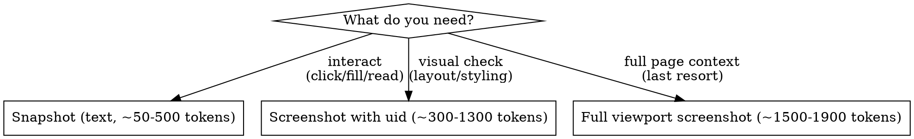

# Browser Interaction

Browser automation via MCP tools (chrome-devtools or playwright).

## Prerequisites

One of these MCP servers must be connected:
- **chrome-devtools** - Connect to Chrome with remote debugging
- **playwright** - Headless/headed browser automation

## Quick Start

```
1. ToolSearch query: "+chrome-devtools list pages snapshot navigate"
2. Navigate: mcp__chrome-devtools__navigate_page(type: "url", url: "...")
3. Snapshot: mcp__chrome-devtools__take_snapshot()
4. Interact using uid from snapshot
```

## MCP Detection

**MCP tools are deferred - load via ToolSearch first:**

```
ToolSearch query: "+chrome-devtools list pages snapshot navigate screenshot"
```

If chrome-devtools unavailable, try playwright:
```
ToolSearch query: "+playwright browser snapshot navigate"
```

## Tool Mapping

| Action | Chrome DevTools | Playwright |
|--------|-----------------|------------|
| List pages | `list_pages` | `browser_tabs` |
| Navigate | `navigate_page` | `browser_navigate` |
| Click | `click` | `browser_click` |
| Fill | `fill` | `browser_type` |
| Screenshot | `take_screenshot` | `browser_take_screenshot` |
| Snapshot | `take_snapshot` | `browser_snapshot` |
| Wait | `wait_for` | `browser_wait_for` |

## RULE 0: Fresh Snapshot After Navigation

After ANY navigation, take a fresh snapshot BEFORE clicking or filling:

```
Navigate → Snapshot → Interact → Verify
         ↑                      │
         └──────────────────────┘
```

**Why:** Element refs (`uid="1_5"`) regenerate per snapshot. Old refs match DIFFERENT elements after navigation.

## RULE 1: Token-Efficient Interaction

Images are expensive. Claude tokenizes images by pixel dimensions only: `tokens = (width × height) / 750`. Format, compression, quality, and color depth have **zero effect** on token count — a grayscale JPEG and a full-color PNG of the same dimensions cost identical tokens.

**Decision flow:**



**Always target elements, not full viewport.** Use the `uid` parameter on `take_screenshot` to capture only the relevant section. On WP admin pages, target the `<main>` element to skip the sidebar (~250 nav elements, ~80% of page noise).

**Snapshot vs screenshot trade-offs:**

| | Snapshot | Screenshot |
|---|---|---|
| **Tokens** | ~50-500 (simple) to ~3,000+ (complex admin pages) | `(w×h)/750` — typically ~1,300-1,900 |
| **Gives UIDs** | Yes — can click/fill | No — read-only visual |
| **Visual info** | None (semantic text only) | Full (layout, icons, colors) |
| **Best for** | All interaction tasks | Visual verification only |

**Warning:** On pages with heavy navigation (WP admin, WooCommerce), snapshots can be MORE expensive than targeted screenshots because the a11y tree includes every sidebar/toolbar link. Prefer element-targeted screenshots for visual checks on these pages.

## Common Operations

**Navigate and inspect:**
```
mcp__chrome-devtools__navigate_page(type: "url", url: "http://localhost:9001/wp-admin/", timeout: 30000)
mcp__chrome-devtools__take_snapshot()
```

**Screenshot of specific element (preferred over full page):**
```
# Use uid from snapshot to target main content area
mcp__chrome-devtools__take_screenshot(uid: "3_272")
```

**Full viewport screenshot (only when full page context is needed):**
```
mcp__chrome-devtools__take_screenshot()
```

**Click element:**
```
# Get uid from snapshot first
mcp__chrome-devtools__click(uid: "1_42", includeSnapshot: true)
```

**Fill input:**
```
mcp__chrome-devtools__fill(uid: "1_15", value: "test@example.com")
```

## Chrome DevTools Profile Locations

chrome-devtools-mcp stores browser profiles at:

| Mode | Profile path | pkill pattern |
|------|-------------|---------------|
| Default | `$HOME/.cache/chrome-devtools-mcp/chrome-profile` | `chrome-devtools-mcp/chrome-profile` |
| `--isolated` | OS temp dir, e.g. `/var/folders/.../puppeteer_dev_chrome_profile-XXXXXX` | `puppeteer_dev_chrome_profile` |

The profile persists across runs unless `--isolated` is used. A killed Chrome process leaves a `SingletonLock` file in the profile dir that blocks the next launch.

## Error Recovery

| Error | Recovery |
|-------|----------|
| "browser is already running" | See kill procedure below |
| "Ref not found" / "No node with given id" | Fresh snapshot, get new uid, retry |
| Network timeout | Wait 2s, retry (max 3 attempts) |

### Killing a Stuck Browser

When chrome-devtools-mcp reports "browser is already running":

```bash
# 1. Try isolated profile first (temp dir) — kills ALL isolated instances
pkill -f 'puppeteer_dev_chrome_profile'

# 2. If that didn't match, try default persistent profile
pkill -f 'chrome-devtools-mcp/chrome-profile'
rm -f "$HOME/.cache/chrome-devtools-mcp/chrome-profile/SingletonLock"
```

Wait 2 seconds after killing before retrying.

**Note:** With `--isolated`, each session gets a unique temp dir (e.g. `puppeteer_dev_chrome_profile-RGjl4g`). The pkill pattern above kills all isolated instances. There is no reliable way to target a specific one without tracing PIDs through the process tree.

## When to Use

- Verifying UI changes after code modifications
- Debugging frontend issues
- Taking screenshots for documentation
- Extracting data from rendered pages
- Testing user flows
