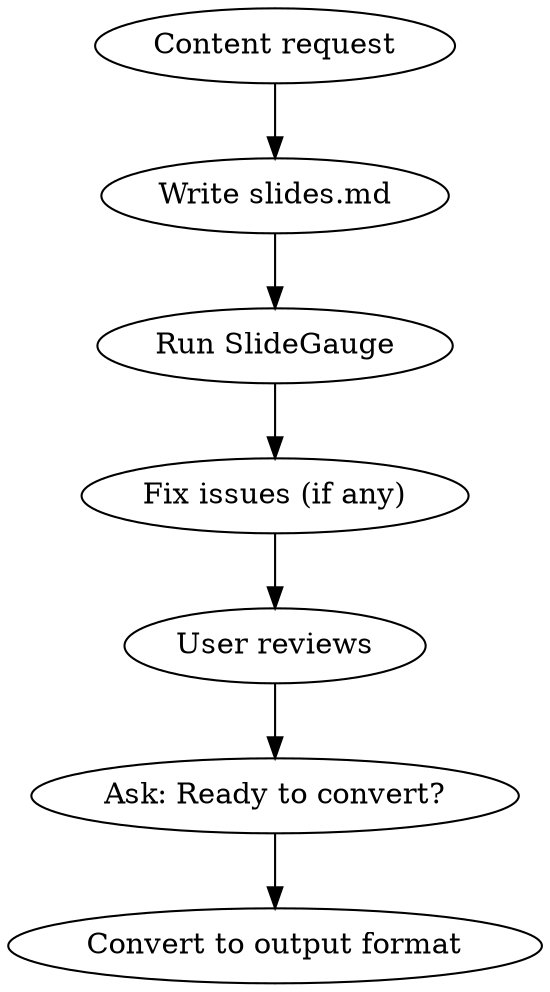

# Creating Markdown Slides

Convert Markdown to presentation slides in multiple formats (PDF, PPTX, HTML).

## Workflow



1. Generate markdown content based on user's request
2. Write to `.md` file (e.g., `slides.md`)
3. **Run quality check** (Marp slides only):
   ```bash
   uvx --from git+https://github.com/nibzard/slidegauge slidegauge slides.md --text
   ```
4. Fix any failing slides (score < 70) before proceeding
5. Tell user: "Created `slides.md` (score: X/100). Review and edit if needed."
6. **Ask before converting**: "Ready to convert to PDF/PPTX/HTML?"
7. Convert using appropriate tool

**Quality thresholds**: 70 = passing, 80 = good, 90+ = excellent. See `marp-slide-quality` skill for fix patterns.

## Tool Selection

| Scenario | Tool | Command |
|----------|------|---------|
| Modern slides, quick output | Marp | `marp slides.md -o slides.pdf` |
| Academic, math-heavy | Pandoc Beamer | `pandoc slides.md -t beamer -o slides.pdf` |
| Editable PowerPoint | Pandoc PPTX | `pandoc slides.md -o slides.pptx` |
| Web presentation | reveal.js | `pandoc slides.md -t revealjs -s -o slides.html` |

## Quick Commands

### Marp (Recommended)

```bash
marp slides.md -o slides.pdf           # PDF
marp slides.md -o slides.pptx          # PowerPoint
marp slides.md -o slides.html          # HTML
marp slides.md --theme gaia -o out.pdf # With theme
marp slides.md -o out.pdf --allow-local-files  # With local images
```

### Pandoc Beamer

```bash
pandoc slides.md -t beamer -o slides.pdf
pandoc slides.md -t beamer --pdf-engine=xelatex -o slides.pdf  # Better fonts
pandoc slides.md -t beamer -V theme:metropolis -o slides.pdf   # With theme
```

### reveal.js

```bash
pandoc slides.md -t revealjs -s -o slides.html
pandoc slides.md -t revealjs -s -V theme=moon -o slides.html
```

## Markdown Formats

### Marp Format

```markdown
---
marp: true
theme: default
paginate: true
---

# Slide Title

Content here

---

# Next Slide

- Bullet points
- More content
```

### Pandoc/Beamer Format

```markdown
---
title: Presentation Title
author: Author Name
---

# Section Title

## Slide Title

- Content
- More content

---

## Another Slide

Content continues
```

## Audience Customization

| Audience | Approach |
|----------|----------|
| **manager** | Executive summary, key metrics, recommendations |
| **developer** | Code examples, technical details |
| **learner** | Step-by-step, progressive complexity |
| **general** | Balanced, accessible language |

## Visual Styles

| Style | Marp Theme | Use Case |
|-------|------------|----------|
| **professional** | `gaia` | Corporate, structured |
| **minimal** | `default` | Clean, whitespace |
| **academic** | Beamer `metropolis` | Formal, math-friendly |

## Content Density

| Length | Slides | Bullets/slide |
|--------|--------|---------------|
| **brief** | 5-8 | 3-4 |
| **standard** | 10-15 | 4-6 |
| **detailed** | 20+ | 5-8 |

## Troubleshooting

| Issue | Solution |
|-------|----------|
| CJK characters broken | Use `--pdf-engine=xelatex` with CJK font |
| Images not loading (Marp) | Add `--allow-local-files` |
| Math not rendering | Add `--mathjax` for reveal.js |
