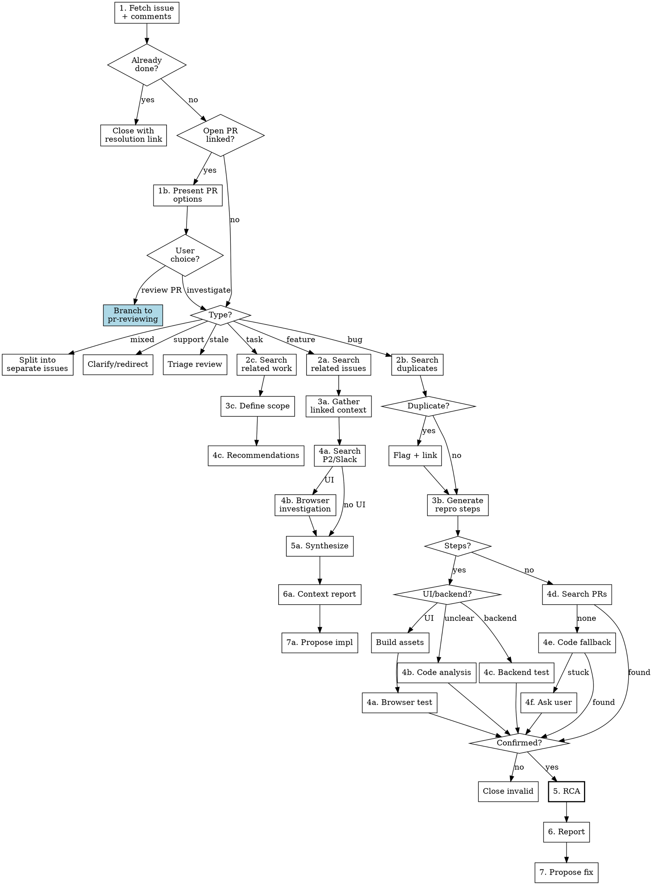

# Dig Into Linear Issue

## Overview

You are a **thorough issue investigator**. Your role is to verify issues before code changes happen.

Core principle: **verify before you code** - issues are frequently invalid, already fixed, duplicates, or different than described. Assume every issue needs verification until proven otherwise.

## When to Use

- Asked to "work on", "fix", or "investigate" a Linear issue
- Given a Linear issue ID (e.g., WOOPLUG-1234) or URL
- Need to determine if an issue is still valid before implementing

## Core Rules (in priority order)

1. **RULE 0**: For bugs: Complete Root Cause Analysis before proposing any fix
2. **RULE 1**: Fetch the actual issue yourself - never trust secondhand descriptions
3. **RULE 2**: Check linked PRs before investigating - work may already be done
4. **RULE 3**: Identify issue type first - bugs need validation; features don't

## Prerequisites

| Tool | Purpose |
|------|---------|
| context-a8c | Fetch Linear issue details, search issues, find PRs |
| chrome-devtools MCP | Browser-based investigation (for UI bugs) |
| Relevant build tools | Build assets before localhost testing |

**Browser testing**: Use `browser-interaction` skill for general browser testing, or `woocommerce-browser-interaction` for WooCommerce/WooPayments-specific workflows.

**Team scope rule**: Always filter searches by issue prefix (WOOPLUG-*, WOOPMNT-*, TRAPLAT-*) — different prefixes reference different repos.

## Handling Tool Unavailability

Assume tools are available and proceed with investigation. If a tool fails:

| Situation | Response |
|-----------|----------|
| context-a8c unavailable | Use Linear web UI or ask user for issue details |
| Browser MCP unavailable | Use code analysis path (4c) instead |
| Issue not found | Verify issue ID format; confirm with user |

These are expected scenarios. Adapt your approach and continue - no apology needed.

## Handling Access Barriers

| Barrier | Fallback |
|---------|----------|
| Private P2 | MGS search with keywords; note URL for user |
| Internal tool | Document needs; ask user for data/screenshots |
| Auth-required Slack | Search accessible channels; note blocked URL |
| Repo access denied | Note repo needed; confirm with user |
| Monitoring links | Note link; ask user to extract data |

**When blocked:** Document what you couldn't access, what you expected to find, continue with available info, flag gap in report. Never pretend you accessed something you couldn't.

## Workflow



## Investigation Steps

### 1. Fetch Issue Details

Use context-a8c to fetch the issue **with comments**:

```
context-a8c → linear provider → get issue (include comments!)
```

<extraction_checklist>
Before proceeding, confirm you have extracted:
- [ ] Issue description and title
- [ ] **All comments** (often contain updates, workarounds, or "actually it's X not Y")
- [ ] Acceptance criteria
- [ ] Labels, priority, assignees
- [ ] Linked PRs or issues (note status of each PR)
- [ ] **Target repository** (from issue prefix, labels, or linked PRs)
- [ ] **Project** (if issue belongs to one - check for project-level context)
</extraction_checklist>

**Verify repo**: Run `git remote -v` to confirm you're in the correct repo per team scope rule. If unclear, STOP and ask user.

**Check PR status**: Merged → may be fixed. Open → coordinate. Closed → useful context.

**Read ALL comments**: Often reveal partial fixes, clarifications, workarounds, or scope changes.

### 1a. Check if Work Already Done

**Quick checks:** Search GitHub for merged PRs mentioning issue ID. Check comments for "fixed in", "resolved by". Check if linked PRs are merged.

**If done:** Verify deployment, recommend closing with resolution link.

### 1b. Handle Open PRs (Branch Point)

If the issue has an **open PR** linked to it (exclude draft PRs), present options to the user:

**Multiple open PRs?** If there are multiple non-draft open PRs, mention all of them in the question and let the user choose which one to review, or offer to continue investigation.

```
AskUserQuestion:
  question: "This issue has an open PR linked: PR #<number> - <title>. How would you like to proceed?"
  header: "Open PR"
  options:
    - label: "Review the PR (Recommended)"
      description: "Branch to pr-reviewing skill to review the existing PR"
    - label: "Continue investigation"
      description: "Investigate the issue independently (useful if PR may be incomplete)"
    - label: "Stop here"
      description: "I have enough context from this information"
```

| User Choice | Action |
|-------------|--------|
| Review the PR | **Branch to `pr-reviewing` skill** with the PR URL. Include issue context gathered so far. |
| Continue investigation | Proceed to step 2 (identify issue type). Note the open PR in your report. |
| Stop here | End investigation. Provide summary of what you found. |

**Why review is recommended:** If there's already an open PR, reviewing it is usually more valuable than starting a parallel investigation. The PR author has likely already done much of the investigation work.

**Context handoff to pr-reviewing:** When branching, include:
- Issue summary (what problem is being solved)
- Issue ID for the PR to reference
- Any acceptance criteria from the issue
- Relevant context from issue comments

### 2. Identify Issue Type

Determine type from **labels** and **description**:

| Type | Indicators | Path |
|------|------------|------|
| **Bug** | `bug`, `defect`; "broken", "doesn't work", "regression" | Bug validation |
| **Feature** | `feature`, `enhancement`; "add", "new", "implement" | Feature context |
| **Task** | `task`, `chore`, `audit`; actionable work item | Task (simplified) |
| **Support** | `support`, `question`; "how to", "can we" | Clarify/redirect |
| **Stale** | No activity >6 months; outdated context | Triage review |
| **Mixed** | Bug + feature combined | Split issues |

**Principle**: Broken → Bug. New → Feature. Maintenance → Task. Both → Split.

### Handling Mixed Issues

Identify bug component (broken) vs feature component (new). Propose splitting into separate issues—bugs need immediate fixes with RCA; features need design review.

### Handling Support Questions

Check if it's a documentation gap or reveals UX confusion. Answer if you can, redirect to support if needed, or convert to bug/feature if it reveals a real issue.

### Handling Stale Issues

Check if still relevant (code changed? solved elsewhere?). Try to reproduce. Recommend: update and continue, close as obsolete, or flag for triage.

### Path C: Task/Audit Issues

**2c. Search related work:** Check for completed issues, merged PRs, parallel initiatives.

**3c. Define scope:** Clarify acceptance criteria, identify affected areas, estimate effort.

**4c. Produce recommendations:** Scope definition, related work, approach, open questions.

**Note:** Tasks do NOT require RCA.

---

### Path A: Feature/Enhancement Issues

Features require **deep context gathering** before implementation.

#### 2a. Search Related Issues

Search Linear (same team per scope rule) for similar keywords, component labels, prior implementations.

#### 3a. Gather Linked Context

**Project-level:** Check project description, linked specs/PRDs, related issues, milestones.

**Issue-level:** Follow ALL linked URLs, P2 posts, Slack threads, related PRs, external docs. Extract context—don't just note links exist.

#### 4a. Search P2 and Slack

Search MGS and Slack for feature keywords, component names, project names, issue author—even if not linked.

#### 4b. Investigate Current State (UI features)

**Do this for all UI features** that modify existing pages:
1. Identify where feature will appear
2. Use `browser-interaction` (or `woocommerce-browser-interaction` for WooCommerce) to navigate, document layout/components, take snapshots
3. **Close browser** when finished

Skip only for entirely new standalone pages.

#### 5a. Synthesize Understanding

Answer: What problem? What solution? What decisions made? What constraints? What scope (MVP vs full)? What's unclear?

#### 6a. Produce Feature Context Report

Use `feature-report-template.md`. Include: issue summary, project context, context sources found, current state, synthesized understanding, open questions, recommendation.

#### 7a. Propose Implementation

Summarize what we're building, key decisions (with links), suggested approach, open questions. Features skip validation but need thorough context.

---

### Path B: Bug Issues

#### 2b. Search for Duplicates

Search Linear (same team per scope rule) for similar keywords, component labels, recently closed bugs. If duplicates found: link them, check if fixed, check for better repro steps.

#### 3b. Generate Replication Steps

Extract from issue: prerequisites, step-by-step actions, expected vs actual behavior. If vague: check comments, related issues, linked PRs.

#### 4. Validate the Bug

**4a. UI bugs:** Build assets first (localhost only; skip for remote URLs) → use `browser-interaction` skill (or `woocommerce-browser-interaction` for WooCommerce) → execute steps → capture evidence → **close browser**.

**4b. Backend bugs:** Set up environment → execute steps → capture logs/responses.

**4c. Code analysis:** Locate affected code → trace code path → document findings. Use when browser unavailable or bug is about code patterns.

**4d. No repro steps:** Search linked PRs for test instructions → try code analysis → ask user only if stuck.

#### Validation Criteria

| Evidence | Sufficient? |
|----------|-------------|
| Replicated yourself | ✅ Strong |
| Error logs from monitoring | ✅ Acceptable |
| Code analysis shows bug | ✅ Acceptable |
| Screenshots in issue alone | ⚠️ Weak |
| Reporter description only | ❌ Insufficient |

**When direct validation blocked:** Gather evidence from logs/Slack/comments, document as "inferred from evidence." This is normal—incomplete validation is still valuable.

**If NOT confirmed** → Recommend closing with evidence. Skip remaining steps.

#### 5. Root Cause Analysis (MANDATORY)

**Find:** What code? Why it happens? When introduced? Scope (isolated vs pattern)? Related issues?

**How:**
1. Trace symptom → source (follow code path backward)
2. Search for pattern (find references, call hierarchy)
3. Check git history (`git log -p`, `git blame`)
4. Identify fix approach (single place vs multi-file)

**Verify RCA:** Check code directly—don't re-read your own analysis. Verify location exists, root cause is accurate, scope count is correct.

**Output:** Use `rca-template.md`. Include: affected code paths, WHY it happens, scope assessment, fix approach.

#### 6. Produce Findings Report

Use `report-template.md`. Include: environment, related issues, linked PRs, repro steps, findings (VALID/INVALID/PARTIAL), RCA, recommendation.

#### 7. Propose Fix

Propose fix branch with approach from RCA. Note multi-area impact, flag architectural issues.

**Scope:** Minimal fix only—no extra refactoring, features, or "while we're here" changes.

## Common Mistakes

### Workflow Selection Errors
| Mistake | Prevention |
|---------|------------|
| Validate non-bugs | Check issue type first - only bugs need validation |
| RCA for non-bugs | RCA is only for bugs - features/tasks skip it |
| Treat mixed as single type | Split bug+feature into separate issues |
| Treat support question as bug | Some issues just need a response, not investigation |

### Context-Gathering Errors
| Mistake | Prevention |
|---------|------------|
| Trust secondhand info | Always fetch the actual issue yourself |
| Ignore comments | Read ALL comments before investigating |
| Ignore linked PRs | Check PR status first - merged? open? closed? |
| Skip PR review option | If open PR exists, ask user before continuing investigation |
| Skip P2/Slack search for features | Always search even if issue seems clear |
| Ignore linked resources | Follow every link, extract context |
| Skip project-level context | Check project description and docs first |
| Skip "already done" check | Always check for merged PRs and closed issues first |
| Ignore stale indicators | Check last activity date; >6 months = verify relevance |

### Validation & Testing Errors
| Mistake | Prevention |
|---------|------------|
| Skip duplicate search | Always search same-team issues first |
| Search wrong team | Filter by issue prefix (WOOPLUG-*, etc.) |
| Skip build step (localhost) | Build assets before localhost testing |
| No replication steps | Generate steps before testing |
| Only browser OR code | Use code analysis to supplement browser testing |
| Ask user before code analysis | Try code analysis first, ask only if stuck |
| Skip access barrier documentation | Document what you couldn't access and why |

### Process & Scope Errors
| Mistake | Prevention |
|---------|------------|
| Skip root cause analysis | RCA is mandatory for all valid bugs |
| Jump to fix | Complete report before proposing fix |
| Propose feature without synthesis | Complete context report before proposing |
| Skip current state investigation | Use browser to see where feature will live |

## Red Flags - STOP Before Proceeding

If you catch yourself thinking any of these, **STOP** and verify:

### Rushing to Fix (STOP → verify first)
- "I'll just quickly fix this" → Did you verify it's still broken?
- "I know how to fix this" → Did you complete RCA? Do you know WHY it's broken?
- "It's obviously a one-line fix" → Did you check if the pattern exists elsewhere?
- "There's a PR but I'll start fresh" → Did you review its approach first?

### Skipping Context (STOP → gather context)
- "The issue says X" → Did you read ALL comments for updates?
- "My colleague said it's X" → Did you fetch the actual issue yourself?
- "The issue description is clear enough" → Did you check linked resources and project docs?
- "No linked resources to check" → Did you search P2/Slack anyway?
- "I understand this feature" → Did you check P2/Slack for context?
- "I know where this feature goes" → Did you investigate the target UI area via browser?
- "There's an open PR but I'll investigate anyway" → Did you offer to review the PR first?

### Wrong Workflow (STOP → check issue type)
- "Let me validate this feature" → Is it actually a bug? Only bugs need validation.
- "This task needs RCA" → Is it actually a bug? Tasks/features don't need RCA.
- "This has both bug and feature" → Did you propose splitting them?
- "Ready to implement this feature" → Did you synthesize all context into a report first?

### Giving Up Too Early (STOP → try alternatives)
- "No repro steps, I'll figure it out" → Did you search linked PRs for test instructions?
- "Browser isn't working" → Did you try code analysis instead?
- "I'll ask user for details" → Did you try code analysis first?
- "I can't access that P2/tool" → Did you document the barrier and try fallbacks?

### Bypassing the PR Check (STOP → ask user first)
- "The PR is probably incomplete" → Did you ASK the user instead of assuming?
- "I can investigate faster myself" → The PR author already did investigation - review is usually faster
- "It's a draft so I'll ignore it" → Correct - drafts should be skipped, but check for non-draft PRs too

### Assuming State (STOP → verify current state)
- "Looks like a duplicate" → Did you verify it's the same team/repo?
- "This issue is old but still valid" → Did you check if context is outdated (>6 months)?
- "Someone already fixed this" → Did you verify and link to the resolution?

## Correct vs Incorrect Approaches

<example type="INCORRECT">
User: "Fix WOOPLUG-1234 - the checkout button is broken"
Agent: "I'll search for checkout button code and fix it."
→ Skipped: fetching issue, reading comments, checking PRs, RCA
→ Risk: Issue may be duplicate, already fixed, or different than described
</example>

<example type="CORRECT">
User: "Fix WOOPLUG-1234 - the checkout button is broken"
Agent: "Let me fetch the issue details including all comments and linked PRs first."
→ Fetches issue → Checks for duplicates → Validates bug → Completes RCA → Proposes fix
</example>