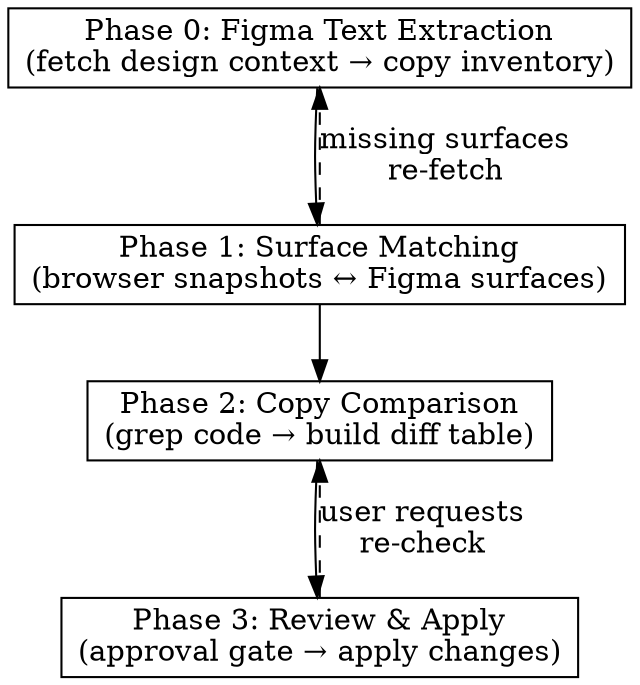

# Figma Copy Sync

Synchronize text copy between Figma designs and implemented code. Extracts all text content from a Figma design, matches it to live UI surfaces in a local environment, compares copy differences, and applies approved changes — respecting i18n patterns.

**Scope:** Visible text (headings, body, buttons, labels, links) plus contextual text (placeholders, tooltips, error messages). Does NOT include programmatic ARIA labels not present in the Figma design.

**Constraint:** Only for already-implemented designs. This skill updates existing copy, it does not implement new UI.

## When to Use

- "Update the copy to match the Figma design"
- "Sync the text in our settings page with Figma"
- "Check if our copy matches the latest designs"
- "The copy in Figma was updated, sync our code"
- Any task that involves comparing or updating text content against a Figma source

## When NOT to Use

- Implementing new UI from Figma (use `using-figma` skill instead)
- Design system token sync (spacing, colors, typography)
- Layout or structural changes
- Designs that haven't been implemented yet

## Iron Rules

| # | Rule | Violation consequence |
|---|------|----------------------|
| R1 | **NEVER modify code without user approval** | Copy changes can have legal, marketing, or UX implications. Always present the full diff table and get explicit approval first. |
| R2 | **NEVER guess at surface matches** | When a Figma surface can't be confidently matched to a code location, STOP and ask the user. Wrong matches → wrong files edited. |
| R3 | **ALWAYS extract text from `get_design_context`, not screenshots** | Screenshots don't give you exact text strings. Structured data does. Use screenshots only for visual matching. |
| R4 | **ALWAYS include ALL states from Figma** | If Figma shows 5 states (default, hover, error, empty, loading), extract copy from all 5 — even if you can't navigate to them in the browser. |
| R5 | **NEVER break i18n wrappers** | If copy is inside `__('text')`, update the string inside the wrapper. Don't remove the wrapper function. Don't change the text domain. |
| R6 | **ALWAYS use the `browser-interaction` skill for browser work** | It handles tool selection, snapshot lifecycle, and error recovery. Never load browser MCP tools directly. Never batch Figma MCP calls with browser MCP calls — different providers cascade-fail together. |

## Figma URL Parsing

Extract `fileKey` and `nodeId` from Figma URLs:

**URL format:** `https://figma.com/design/:fileKey/:fileName?node-id=1-2`
- **fileKey:** segment after `/design/`
- **nodeId:** value of `node-id` query param (use as-is, with the hyphen)

Example: `https://figma.com/design/kL9xQn2VwM8pYrTb4ZcHjF/DesignSystem?node-id=42-15`
→ fileKey=`kL9xQn2VwM8pYrTb4ZcHjF`, nodeId=`42-15`

## Prerequisites

**Figma MCP tools** — Load before Phase 0:
```
ToolSearch query: "+figma get_design_context get_metadata get_screenshot"
```

**Browser interaction** — Use the `browser-interaction` skill for ALL browser work (navigation, snapshots, screenshots). Do NOT load browser MCP tools directly. The skill handles tool selection (chrome-devtools vs. playwright), the snapshot-before-interact loop, and error recovery.

**Invoke at Phase 1 start:**
```
Skill: browser-interaction
```

## Workflow



### Phase 0: Figma Text Extraction

**Goal:** Build a complete inventory of every text element in the Figma design, organized by UI surface and component state.

**Input:** Figma URL or file key + node ID.

1. **Parse Figma URL** — Extract fileKey and nodeId.

2. **Fetch metadata** — Call `get_metadata` on the target node to understand the hierarchy.
   - If response > 50K chars, save to `.claude/tmp/figma-copy-sync/metadata-<nodeId>.json` and parse with:
     ```bash
     python3 <plugin-scripts>/figma-parse-nodes.py <saved-file> --format tree
     ```

3. **Identify UI surfaces** — From the hierarchy, classify nodes into:
   - **Page-level surfaces** (full screens or page sections)
   - **State variants** (same surface in different states: default, hover, error, empty, loading, disabled)
   - **Skip** wrapper/title frames (these contain trivial content)

4. **Fetch design context** — Call `get_design_context` for each target surface node. Use parallel calls for independent nodes. **Figma MCP calls only — never batch with browser calls.**

5. **Extract text nodes** — From each `get_design_context` response, extract:
   - **Text content** (the exact string)
   - **Element role** (heading, body, button label, link text, placeholder, tooltip, error message)
   - **Parent surface** (which UI surface this text belongs to)
   - **State** (which component state this text appears in)

6. **Classify each text element** — Not all text in Figma is syncable copy. Classify each extracted text node:

   | Classification | Description | Examples | Action |
   |---------------|-------------|----------|--------|
   | **Static copy** | Labels, headings, descriptions, button text, error messages — fixed strings in code | "Payment Settings", "Save changes", "No results found" | Sync normally |
   | **Mixed (static + dynamic)** | Static copy containing dynamic placeholders shown as example data in Figma | "Showing 1-20 of 147 results" → code has `sprintf('Showing %1$d-%2$d of %3$d results')` | Sync the static parts, preserve placeholders |
   | **Dynamic data** | Values rendered entirely from variables — prices, dates, user names, counts with no surrounding static text | "$49.99", "John Doe", "March 1, 2026" | Exclude from sync |
   | **Design placeholder** | Lorem ipsum, sample data used for layout purposes only | "Lorem ipsum dolor sit amet" | Exclude from sync |
   | **Uncertain** | Cannot confidently classify | — | Flag for user at checkpoint |

   **How to identify mixed strings:** Look for text that contains numbers, currency, dates, or proper nouns embedded within a natural-language sentence. The sentence structure is static copy; the specific values are dynamic placeholders.

   **How to identify dynamic data:** Text that is purely a value with no surrounding label — standalone numbers, prices, names, dates, or IDs. These appear in table cells, badges, or data fields rather than in headings, descriptions, or buttons.

7. **Take visual references** — Call `get_screenshot` for each UI surface (default state at minimum).

8. **Write Figma Copy Inventory** — Save to `.claude/tmp/figma-copy-sync/<feature>-inventory.md`. Only include Static, Mixed, and Uncertain items. Exclude Dynamic data and Design placeholders.

```markdown
# Figma Copy Inventory: [Feature Name]

**Figma file:** `<fileKey>`
**Root node:** `<nodeId>`
**Generated:** YYYY-MM-DD HH:MM

## Surface: [Surface Name]

**Figma node:** `<nodeId>`
**States found:** default, error, empty

### State: Default

| # | Element Role | Text Content | Classification |
|---|-------------|-------------|----------------|
| 1 | Heading | "Payment Settings" | Static |
| 2 | Description | "Configure your payment methods and preferences." | Static |
| 3 | Button | "Save changes" | Static |
| 4 | Placeholder | "Search payment methods..." | Static |
| 5 | Table header | "Showing 1-20 of 147 results" | Mixed |
| 6 | Price cell | "$49.99" | Dynamic data |

### State: Error

| # | Element Role | Text Content | Classification |
|---|-------------|-------------|----------------|
| 1 | Error message | "Unable to save payment settings. Please try again." | Static |

### State: Empty

| # | Element Role | Text Content | Classification |
|---|-------------|-------------|----------------|
| 1 | Empty heading | "No payment methods" | Static |
| 2 | Empty description | "Add a payment method to start accepting payments." | Static |
| 3 | Button | "Add payment method" | Static |
```

**Output:** Figma Copy Inventory document + screenshots saved as visual reference.

**Checkpoint:** Present the inventory to the user, including the classification of each text element. Ask: "Does this capture all the surfaces and states you want to sync? Are the classifications correct (especially any marked Uncertain)? Any surfaces to add or skip?"

### Phase 1: Surface Matching

**Goal:** Explore the local environment UI surfaces, then match each Figma surface to a live page/section.

**Dependency:** Invoke the `browser-interaction` skill before any browser work in this phase.

1. **Get local environment URL** — Ask the user for the base URL (e.g., `http://localhost:8080`) and the entry point page(s) where the designed UI lives.

2. **Explore the live UI** — Using the browser-interaction skill:
   a. Navigate to the entry point URL.
   b. Take a snapshot (accessibility tree) to read the full text content and page structure.
   c. Take a screenshot of the main content area for visual reference.
   d. If the page has navigation (tabs, sidebar links, sub-pages), explore each section to discover all available surfaces.
   e. For each distinct section/page found, record:
      - The URL
      - A section description (what part of the page)
      - The visible text content from the snapshot
      - A screenshot

3. **Match Figma surfaces to discovered UI** — For each Figma surface from the Phase 0 inventory:
   a. Compare the Figma text content and visual layout against the explored browser surfaces.
   b. Match by text overlap — if a browser section contains the same headings, labels, or body text as a Figma surface, that's a match.

4. **Report matches clearly** — For each Figma surface, report:

   **Confident match:**
   ```
   ✓ MATCHED: Figma "Payment Settings Header"
     → Browser: http://localhost:8080/wp-admin/settings/payments (header section)
     → Text overlap: "Payment Settings", "Configure your payment methods", "Save changes"
   ```

   **Ambiguous or no match:**
   ```
   ? UNMATCHED: Figma "Refund Policy Banner"
     → Figma text: "Refunds are processed within 5-7 business days."
     → [Figma screenshot shown]
     → Not found in any explored browser surface.
   ```
   **→ ASK the user:** "Which page/section does this Figma surface map to? Provide a URL and describe where on the page it appears, or say 'skip' to exclude it."

5. **Build confirmed surface map:**

```markdown
## Surface Map

| Figma Surface | Figma Node | Browser URL | Page Section | Status |
|--------------|-----------|-------------|-------------|--------|
| Payment Settings Header | 42-15 | localhost:8080/.../payments | Main header | MATCHED |
| Payment Methods List | 42-20 | localhost:8080/.../payments | Methods table | MATCHED |
| Refund Policy Banner | 42-30 | localhost:8080/.../refunds | Top banner | USER-CONFIRMED |
| Checkout Warning | 42-35 | — | — | SKIPPED |
```

6. **Persist the surface map** — Append the surface map to the inventory document (`.claude/tmp/figma-copy-sync/<feature>-inventory.md`). This prevents loss during long sessions if context compresses.

**Output:** Confirmed surface map with browser URLs and section locations.

### Phase 2: Copy Comparison

**Goal:** For each matched surface, find the copy in the codebase, compare with Figma, and build a complete diff table.

1. **For each matched surface and EVERY state:**

   a. **Get current copy from browser** — Using the browser-interaction skill, take a snapshot (accessibility tree) to read the current text content from the live UI (for navigable states).

   b. **Find copy in codebase** — Strategy depends on classification from Phase 0:

      **For Static copy:** Grep for the exact string. Record: file path, line number, surrounding context.

      **For Mixed copy (static + dynamic):** The browser shows rendered text (e.g., "Showing 1-20 of 147 results") but code has format specifiers (e.g., `sprintf('Showing %1$d-%2$d of %3$d results')`). To find these:
      - Strip the dynamic segments (numbers, prices, names, dates) from the Figma/browser text
      - Grep for the remaining static fragments (e.g., "Showing" + "of" + "results")
      - Search for `sprintf`, `_n`, `%d`, `%s`, `%f` patterns near the component's files
      - Once found, record the full format string including placeholders

      **For text not found by exact grep:** Before flagging as NOT-FOUND, try the mixed-copy strategy above — the string may contain dynamic segments you didn't initially classify.

      **If text appears in multiple files:** This is common (PHP + JS dual rendering, shared components). Record ALL locations and present them to the user in the diff table — don't silently pick one.

   c. **Detect i18n pattern** — Check if the text is wrapped in a translation function:

   | Pattern | Language | Example |
   |---------|----------|---------|
   | `__('text', 'domain')` | PHP (WordPress) | `__( 'Save changes', 'woocommerce' )` |
   | `_e('text', 'domain')` | PHP (WordPress, echo) | `_e( 'Settings', 'woocommerce' )` |
   | `esc_html__('text', 'domain')` | PHP (WordPress, escaped) | `esc_html__( 'Payment', 'woocommerce' )` |
   | `esc_attr__('text', 'domain')` | PHP (WordPress, attr escaped) | `esc_attr__( 'Search', 'woocommerce' )` |
   | `_n('single', 'plural', $n, 'domain')` | PHP (WordPress, plural) | `_n( '%d item', '%d items', $count, 'woocommerce' )` |
   | `__('text')` | JS (wp-i18n) | `__( 'Save changes' )` |
   | `_n('single', 'plural', n)` | JS (wp-i18n, plural) | `_n( '%d item', '%d items', count )` |
   | `<FormattedMessage id="..." defaultMessage="text" />` | React (react-intl) | `<FormattedMessage defaultMessage="Save" />` |
   | `t('key')` with JSON source | JS (i18next) | `t('settings.save')` → lookup in JSON |
   | No wrapper (inline) | Any | `<h1>Payment Settings</h1>` |

   d. **Compare Figma vs. code** — For each text element:
      - **IDENTICAL** — Figma and code match exactly
      - **DIFFERENT** — Figma and code differ (the change to apply)
      - **MIXED-CHANGED** — Mixed string where the static parts differ but placeholders are preserved (e.g., code has `'Showing %1$d-%2$d of %3$d results'`, Figma implies `'Displaying %1$d-%2$d of %3$d results'`)
      - **MIXED-NEW-PLACEHOLDER** — Mixed string where Figma implies a new placeholder not in code (e.g., code has `'%d items'`, Figma shows "3 items ($49.99)" suggesting a price placeholder). **Flag for user attention.**
      - **STATE-ONLY** — Text exists only in a non-default Figma state; find it by grepping for current code copy (it may exist in the code but not be visible in the current browser state)

   e. **For states not navigable in the browser** — Use the Figma copy inventory from Phase 0. Search the codebase for likely text patterns (error messages near the component, empty state text, loading text). If found, compare. If not found, flag as "new copy — not found in code" for user attention.

2. **Build the diff table:**

```markdown
## Copy Diff: [Feature Name]

### Surface: Payment Settings Header

| # | Element | Current (Code) | Figma | File | Line | i18n | Status |
|---|---------|---------------|-------|------|------|------|--------|
| 1 | Heading | Payment settings | Payment Settings | settings.tsx | 42 | `__()` | DIFFERENT |
| 2 | Description | Manage your payment methods | Configure your payment methods and preferences | settings.tsx | 43 | `__()` | DIFFERENT |
| 3 | Button | Save | Save changes | settings.tsx | 87 | `__()` | DIFFERENT |
| 4 | Placeholder | Search... | Search payment methods... | settings.tsx | 55 | `__()` | DIFFERENT |
| 5 | Link | Learn more | Learn more | settings.tsx | 48 | `__()` | IDENTICAL |
| 6 | Results count | Showing %1$d-%2$d of %3$d results | Displaying %1$d-%2$d of %3$d results | list.tsx | 31 | `sprintf(__())` | MIXED-CHANGED |

### Surface: Payment Settings — Error State

| # | Element | Current (Code) | Figma | File | Line | i18n | Status |
|---|---------|---------------|-------|------|------|------|--------|
| 1 | Error msg | Something went wrong | Unable to save payment settings. Please try again. | settings.tsx | 102 | `__()` | DIFFERENT |
```

**Summary statistics:**
```
Total text elements: 12
Identical: 3
Different: 7
State-only: 1
Not found in code: 1
```

**Output:** Complete diff table with file locations, i18n detection, and status per element.

### Phase 3: Review & Apply

**Goal:** Present all copy differences for user approval, apply approved changes, and produce a sync report.

1. **Present the diff table** — Show the complete diff from Phase 2, organized by surface and state. Only show elements with status DIFFERENT, MIXED-CHANGED, MIXED-NEW-PLACEHOLDER, STATE-ONLY, or NOT-FOUND (skip IDENTICAL). Highlight MIXED-NEW-PLACEHOLDER items — these require user attention because they imply code changes beyond copy updates.

2. **Ask for approval:**
   - "Here are all the copy differences between Figma and code. Review each change and tell me:
     - **Approve all** — apply every change
     - **Approve with exceptions** — list the items to skip (by number)
     - **Review individually** — I'll present each change one at a time"

3. **Apply approved changes:**

   For each approved change:

   a. **If i18n wrapped** — Replace only the text string inside the translation function. Preserve the function, text domain, and any escaping wrapper:
      ```
      // Before
      __( 'Payment settings', 'woocommerce' )
      // After
      __( 'Payment Settings', 'woocommerce' )
      ```

   b. **If inline (no i18n)** — Replace the text directly:
      ```
      // Before
      <h1>Payment settings</h1>
      // After
      <h1>Payment Settings</h1>
      ```

   c. **If plural form** (`_n`) — Update both singular and plural strings if Figma provides both.

   d. **If MIXED-CHANGED** — Update only the static text parts of the format string. Preserve all existing placeholders (`%d`, `%s`, `%1$d`, etc.) in their original positions:
      ```
      // Before
      sprintf( __( 'Showing %1$d-%2$d of %3$d results', 'woocommerce' ), $start, $end, $total )
      // After — only static text changed, placeholders preserved
      sprintf( __( 'Displaying %1$d-%2$d of %3$d results', 'woocommerce' ), $start, $end, $total )
      ```

   e. **If MIXED-NEW-PLACEHOLDER** — Do NOT auto-apply. Report to user: "Figma implies a new dynamic value (e.g., a price, count, or name) that doesn't exist as a placeholder in the current code. This requires a code change beyond copy sync — a new variable or data source may need to be added." Present the current format string and what the Figma text implies, so the user can decide how to handle it.

   f. **If translation JSON** — Update the value for the corresponding key in the JSON file.

   g. **If NOT-FOUND** — Report to user: "This text from Figma was not found in the codebase. It may need to be added as part of a feature implementation." Do not create new code.

4. **Write sync report** — Save to `.claude/tmp/figma-copy-sync/<feature>-sync-report.md`:

```markdown
# Copy Sync Report: [Feature Name]

**Figma file:** `<fileKey>`, node `<nodeId>`
**Synced:** YYYY-MM-DD HH:MM

## Applied Changes

| # | Surface | Element | Old Copy | New Copy | File | Line |
|---|---------|---------|----------|----------|------|------|
| 1 | Settings Header | Heading | Payment settings | Payment Settings | settings.tsx | 42 |
| ... | | | | | | |

## Skipped (User Rejected)

| # | Surface | Element | Reason |
|---|---------|---------|--------|
| — | — | — | — |

## Unresolved

| # | Surface | Element | Issue |
|---|---------|---------|-------|
| 1 | Error Banner | Error msg | Not found in codebase — may need implementation |

## Summary

- Surfaces synced: 4 of 5
- Changes applied: 7
- Skipped: 0
- Unresolved: 1
```

5. **Show summary** — Present a brief summary of what was changed, what was skipped, and what needs attention.

**Output:** Sync report document + applied code changes.

## Figma MCP Tool Reference

Only the tools relevant to copy sync:

| Tool | Purpose | When |
|------|---------|------|
| `get_design_context` | Structured design data including text content | Phase 0 — primary tool for text extraction |
| `get_metadata` | Sparse XML outline of layer hierarchy | Phase 0 — understand structure before targeted fetches |
| `get_screenshot` | Visual screenshot of a node | Phase 0 (reference) + Phase 1 (comparison) |

**Not needed for copy sync:** `get_variable_defs` (tokens), `get_code_connect_map` (component mapping), `create_design_system_rules` (design system setup).

## Handling Failures

| Failure | Recovery |
|---------|----------|
| Truncated `get_design_context` response | Save what you got, re-fetch child nodes individually |
| Empty/null Figma response | Retry once. If still empty, verify node ID with `get_metadata`, then retry with correct ID |
| Figma MCP connection error | Inform user and pause. Do not invent text content. |
| Browser can't reach local env | The browser-interaction skill handles error recovery. If it still fails, ask user for correct URL and verify the dev server is running. |
| Text found in multiple code locations | Show all locations to user, ask which is the canonical one |
| i18n pattern not recognized | Treat as inline text but flag with a warning for user to verify |

## Caching

| What | Where | Invalidation |
|------|-------|-------------|
| Figma metadata | `.claude/tmp/figma-copy-sync/metadata-<nodeId>.json` | When Figma design changes |
| Copy inventory | `.claude/tmp/figma-copy-sync/<feature>-inventory.md` | Per sync session |
| Sync report | `.claude/tmp/figma-copy-sync/<feature>-sync-report.md` | Per sync session |
