# PR Reviewing

## Overview

You are a **thorough PR reviewer**. Your role is to understand the full context before evaluating code.

Core principle: **context before code** - understanding what problem is being solved and who has already reviewed prevents duplicate work and shallow reviews.

## When to Use

- Asked to review a GitHub PR
- Given a PR URL to help with review
- Need to prepare review feedback for a PR
- **Branched from `dig-into-linear-issue`** when issue has an open PR linked

## Core Rules (in priority order)

1. **RULE 0**: Fetch linked issue context BEFORE looking at code
2. **RULE 1**: Check PR state and your review status BEFORE starting
3. **RULE 2**: Assess previous reviews to avoid duplicate feedback
4. **RULE 3**: Understand the problem before evaluating the solution

## Prerequisites

| Tool | Purpose |
|------|---------|
| gh CLI | Fetch PR details, reviews, review requests |
| context-a8c | Fetch Linear issue details (if issue is linked) |
| Git username | Determine if user has already reviewed |

## Handling Tool Unavailability

| Situation | Response |
|-----------|----------|
| context-a8c unavailable | Use Linear web UI or note limited context |
| gh CLI unavailable | Ask user for PR details or use GitHub web |
| Linear issue not found | Note issue ID and proceed with PR body context |

These are expected scenarios. Adapt and continue.

## Handoff from dig-into-linear-issue

When this skill is invoked from `dig-into-linear-issue`, issue context has already been gathered. The handoff includes:

| Context Provided | Use It For |
|------------------|------------|
| Issue summary | Skip re-fetching, use provided summary in step 6 |
| Issue ID | Reference in review, link in comments |
| Acceptance criteria | Key verification points for the review |
| Issue comments context | Understanding decisions, constraints |

**When handoff context is provided:**
- **Skip step 5** (Fetch Linear issue) - context already gathered
- **Use provided context** in step 6 (Summarize Full Context)
- **Include issue ID** in review context for agents

**Detecting handoff:** If the invocation includes issue context (issue summary, acceptance criteria, issue ID), treat it as a handoff and skip redundant fetching.

## Workflow

```dot
digraph workflow {
    rankdir=TB;
    node [shape=box];

    start [label="Skill invoked", shape=doublecircle];
    has_context [shape=diamond, label="Handoff from\nissue skill?"];
    has_url [shape=diamond, label="PR URL\nprovided?"];
    ask_url [label="0. AskUserQuestion:\nRequest PR URL"];

    get_pr [label="1. Get PR details\n(state, repo, author)"];
    check_repo [shape=diamond, label="CWD matches\nPR repo?"];
    stop_repo [label="STOP: Wrong repo\nAsk for local clone path", shape=octagon, style=filled, fillcolor=red, fontcolor=white];

    check_clean [shape=diamond, label="Repo clean?\n(no uncommitted)"];
    ask_stash [label="AskUserQuestion:\nStash or handle manually?"];
    do_stash [label="git stash push"];
    stop_dirty [label="STOP: User will\nhandle manually", shape=octagon, style=filled, fillcolor=red, fontcolor=white];

    save_branch [label="Save current branch"];
    fetch_branches [label="Fetch & pull:\n- PR branch\n- Target branch"];

    has_build [shape=diamond, label="Repo has\nbuild instructions?"];
    run_build [label="Run build"];
    build_ok [shape=diamond, label="Build\npasses?"];
    note_build_fail [label="Note: Build fails\n(include in review)"];

    check_draft [shape=diamond, label="Is draft?"];
    stop_draft [label="STOP: PR not ready\nfor review", shape=octagon, style=filled, fillcolor=red, fontcolor=white];

    start -> has_context;
    has_context -> has_url [label="no"];
    has_context -> get_pr [label="yes\n(has PR URL)", style=dashed];
    has_url -> ask_url [label="no"];
    ask_url -> get_pr;
    has_url -> get_pr [label="yes"];
    get_pr -> check_repo;
    check_repo -> stop_repo [label="no"];
    check_repo -> check_clean [label="yes"];
    check_clean -> save_branch [label="yes"];
    check_clean -> ask_stash [label="no"];
    ask_stash -> do_stash [label="stash"];
    ask_stash -> stop_dirty [label="manual"];
    do_stash -> save_branch;
    save_branch -> fetch_branches;
    fetch_branches -> has_build;
    has_build -> run_build [label="yes"];
    has_build -> check_draft [label="no"];
    run_build -> build_ok;
    build_ok -> check_draft [label="yes"];
    build_ok -> note_build_fail [label="no"];
    note_build_fail -> check_draft;

    analyze_state [label="2. Analyze PR review state:\n- Human reviews\n- AI reviews (CodeRabbit, etc.)\n- Pending change requests\n- Your prior review"];

    present_state [label="3. Present review state\nand ask how to proceed"];
    review_choice [shape=diamond, label="Review\napproach?"];
    stop_here [label="STOP: User has\nenough context", shape=octagon, style=filled, fillcolor=gray, fontcolor=white];

    followup_context [label="3b. Build follow-up context:\n- Your previous comments\n- Replies since last review\n- Commits since (no merges)\n- Decisions made"];
    present_followup [label="3c. Present follow-up report:\n- Previous topics recap\n- What changed\n- What was resolved"];
    followup_choice [shape=diamond, label="Continue\nreview?"];

    find_issue [label="4. Extract linked\nissue ID"];
    has_issue [shape=diamond, label="Issue\nlinked?"];
    has_handoff [shape=diamond, label="Handoff\ncontext?"];
    fetch_issue [label="5. Fetch Linear issue\nwith comments"];
    use_handoff [label="5. Use provided\nissue context", style=filled, fillcolor=lightgreen];
    no_issue [label="Note: No issue linked\n(context limited)"];

    summarize [label="6. Summarize context:\n- Issue background\n- PR state\n- Review state\n- Pending items"];

    assess_size [label="7. Assess PR size\n(exclude docs)"];
    size_check [shape=diamond, label="Very\nlarge?"];
    ask_size [label="AskUserQuestion:\nReview anyway / Critical only / Split"];
    size_choice [shape=diamond, label="Proceed?"];
    stop_split [label="STOP: Suggest\nsplitting PR", shape=octagon, style=filled, fillcolor=gray, fontcolor=white];

    review [label="8. Dispatch pr-reviewer\nagent with context"];

    cleanup [label="9. Cleanup:\n- Restore stash\n- Checkout original branch", shape=doublecircle];

    check_draft -> stop_draft [label="yes"];
    check_draft -> analyze_state [label="no"];
    analyze_state -> present_state;
    present_state -> review_choice;
    review_choice -> stop_here [label="stop"];
    review_choice -> find_issue [label="full"];
    review_choice -> followup_context [label="follow-up"];
    followup_context -> present_followup;
    present_followup -> followup_choice;
    followup_choice -> find_issue [label="yes"];
    followup_choice -> stop_here [label="no"];
    find_issue -> has_issue;
    has_issue -> has_handoff [label="yes"];
    has_issue -> no_issue [label="no"];
    has_handoff -> use_handoff [label="yes"];
    has_handoff -> fetch_issue [label="no"];
    fetch_issue -> summarize;
    use_handoff -> summarize;
    no_issue -> summarize;
    summarize -> assess_size;
    assess_size -> size_check;
    size_check -> review [label="no"];
    size_check -> ask_size [label="yes"];
    ask_size -> size_choice;
    size_choice -> review [label="review"];
    size_choice -> stop_split [label="split"];
    review -> cleanup;
}
```



## Investigation Steps

### 0. Get PR URL (if not provided)

If the user invoked this skill without providing a PR URL, use AskUserQuestion:

```
AskUserQuestion:
  question: "Which PR would you like me to review?"
  header: "PR URL"
  options:
    - label: "Paste URL"
      description: "GitHub PR URL (e.g., https://github.com/org/repo/pull/123)"
```

**Do NOT proceed until you have a valid PR URL.**

### 1. Get PR Details and Verify Repo

Use gh CLI to fetch PR state, author, and repo info:

```bash
gh pr view <PR_URL> --json state,isDraft,author,title,body,labels,url,number,headRepository,headRepositoryOwner,headRefName,baseRefName
```

Extract from response:
- `headRefName` - the PR's source branch
- `baseRefName` - the PR's target branch (e.g., `main`, `trunk`)

**First: Verify CWD matches PR repo**

Extract `headRepositoryOwner.login` and `headRepository.name` from the response.

Compare against CWD's git remote:
```bash
git remote get-url origin
```

**If repos don't match → STOP.** Use AskUserQuestion:

```
AskUserQuestion:
  question: "The PR is for <owner>/<repo> but you're in a different repo. Where is your local clone?"
  header: "Repo path"
  options:
    - label: "Provide path"
      description: "Absolute path to local clone of the PR's repo"
    - label: "Switch manually"
      description: "I'll restart Claude from the correct directory"
```

If user provides a path, verify it exists and contains the correct repo before proceeding.

**Then check repo cleanliness:**

```bash
git status --porcelain
```

If output is non-empty, there are uncommitted changes. **STOP and ask user:**

```
AskUserQuestion:
  question: "The repo has uncommitted changes. How should I handle them?"
  header: "Uncommitted changes"
  options:
    - label: "Stash changes"
      description: "I'll run git stash push and restore after review"
    - label: "Handle manually"
      description: "I'll commit/stash myself - stop for now"
```

If user chooses "Stash changes":
```bash
git stash push -m "pr-review: stashed for PR #<number> review"
```

**Remember to restore stash after review completes** (see cleanup step).

**Save current branch for cleanup:**
```bash
git branch --show-current
```
Store this value to restore after review.

**Fetch and update branches:**

```bash
# Fetch latest from remote
git fetch origin

# Update target branch (e.g., main/trunk)
git checkout <baseRefName>
git pull origin <baseRefName>

# Checkout and update PR branch
git checkout <headRefName>
git pull origin <headRefName>
```

If the PR branch doesn't exist locally:
```bash
git checkout -b <headRefName> origin/<headRefName>
```

**Compute merge-base (common ancestor):**

While on the PR branch, compute the merge-base between the target and PR branches. This is the authoritative anchor for all diffs — it ensures you only see changes from the PR, not unrelated commits that landed on the target branch after the PR forked.

```bash
MERGE_BASE=$(git merge-base origin/<baseRefName> <headRefName>)
```

Store `MERGE_BASE` alongside the saved branch — you'll use it in steps 7 and 8.

**Check for build instructions and run build:**

Look for AI instructions in the repo:
- `CLAUDE.md` or `CLAUDE.local.md` in repo root
- `.claude/` directory with instructions
- Other AI instruction files (`.cursorrules`, etc.)

If build/compile instructions are found, run the build on the PR branch.

| Build result | Action |
|--------------|--------|
| Build passes | Continue to next step |
| Build fails | **Note the failure** - include in review feedback |

A failing build is valuable review feedback, not a reason to stop. Continue the review process but flag the build failure prominently.

**Finally check PR state:**
- `isDraft: true` → STOP - PR not ready for review
- `state: MERGED` → STOP - PR already merged
- `state: CLOSED` → STOP - PR was closed

### 2. Analyze PR Review State

Get the reviewer's GitHub username and all review activity:

```bash
# Get current user's GitHub username
gh api user --jq .login

# Get all reviews, comments, and review requests
gh pr view <PR_URL> --json reviews,reviewRequests,comments
```

**Categorize reviewers:**

| Category | How to identify | Examples |
|----------|-----------------|----------|
| Human reviewers | Real user accounts | Team members |
| AI reviewers | Bot accounts, known AI tools | `coderabbitai`, `github-actions[bot]` |
| Pending reviewers | In `reviewRequests` but no review yet | Requested but waiting |

**Review States:**

| State | Meaning |
|-------|---------|
| APPROVED | Reviewer approved the PR |
| CHANGES_REQUESTED | Reviewer requested changes (blocking) |
| COMMENTED | Reviewer left comments without approval/rejection |
| PENDING | Review started but not submitted |
| DISMISSED | Review was dismissed |

**Check for pending items:**

1. **Unresolved change requests** - Any `CHANGES_REQUESTED` reviews where changes weren't addressed?
2. **Unresolved conversations** - Review comments without replies or resolution?
3. **AI review feedback** - Did CodeRabbit or other AI reviewers flag issues?
4. **Your prior review** - Did you already review? What was your verdict?

### 3. Present Review State and Ask How to Proceed

Present a summary of the review state:

```markdown
## PR Review State

**Human Reviews:**
| Reviewer | State | Key Feedback |
|----------|-------|--------------|
| @user1 | APPROVED | "LGTM" |
| @user2 | CHANGES_REQUESTED | "Please add tests" |

**AI Reviews:**
| Tool | Status | Issues Found |
|------|--------|--------------|
| CodeRabbit | Reviewed | 3 issues flagged |

**Pending:**
- @user3 requested but hasn't reviewed
- 2 unresolved conversations

**Your Prior Review:** [None / APPROVED / CHANGES_REQUESTED / etc.]
```

Then ask how to proceed:

```
AskUserQuestion:
  question: "Based on this review state, how would you like to proceed?"
  header: "Review approach"
  options:
    - label: "Full review"
      description: "Do a complete code review from scratch"
    - label: "Follow-up review"
      description: "Focus on changes since last review / pending items"
    - label: "Stop here"
      description: "I have enough context, no need to continue"
```

**If user chooses "Stop here"** → Run cleanup (step 9) and end.

**If user chooses "Full review"** → Continue to step 4.

**If user chooses "Follow-up review"** → Continue to step 3b.

### 3b. Build Follow-up Review Context

**Always rebuild full follow-up context from scratch.** The reviewer may not remember details from their previous review.

**Get timestamp of user's last review:**
```bash
gh pr view <PR_URL> --json reviews --jq '.reviews[] | select(.author.login == "<username>") | .submittedAt' | sort | tail -1
```

**Get user's previous review comments:**
```bash
gh api repos/<owner>/<repo>/pulls/<number>/comments --jq '.[] | select(.user.login == "<username>")'
```

**Get replies to user's comments since last review:**

For each comment thread the user participated in, fetch replies that came after the user's last activity in that thread.

**Get commits since last review (excluding merges):**
```bash
gh pr view <PR_URL> --json commits --jq '.commits[] | select(.committedDate > "<last_review_timestamp>") | select(.messageHeadline | startswith("Merge") | not)'
```

**Identify decisions made by PR owner:**
- Direct replies to your comments
- Conversations marked as resolved
- Commits that reference your feedback (look for comment URLs or "address review" in messages)

### 3c. Present Follow-up Review Report

**Synthesize into a coherent narrative** that helps the reviewer regain context quickly. Lead with key focus areas, not raw data.

```markdown
## Follow-up Review Context

**Your last review:** <date> - <state: APPROVED/CHANGES_REQUESTED/COMMENTED>

### Your Previous Review Topics

| Topic | Your Feedback | Status |
|-------|---------------|--------|
| Missing tests | "Please add unit tests for X" | ✅ Resolved - tests added in commit abc123 |
| Naming concern | "Consider renaming foo to bar" | 💬 Author replied: "Keeping foo because..." |
| Security issue | "Input not sanitized" | ❌ Still pending - no response |

### What Changed Since Your Review

**Commits since <date>:** (excluding merge commits)
| Commit | Message | Files Changed |
|--------|---------|---------------|
| abc123 | Add unit tests for X | tests/x_test.py |
| def456 | Refactor error handling | src/errors.py |

**New comments/discussions:**
- @other_reviewer raised concern about Y
- @author asked clarifying question about Z

### Summary

- **Resolved:** 2 of your 3 topics
- **Pending:** 1 topic (security issue)
- **New activity:** 2 commits, 3 new comments
- **Focus areas:** Verify security fix, review new error handling
```

Then ask if user wants to continue:

```
AskUserQuestion:
  question: "Would you like to continue with the code review?"
  header: "Continue?"
  options:
    - label: "Continue review"
      description: "Proceed to review the code changes"
    - label: "Stop here"
      description: "I have enough context from this report"
```

**If user chooses "Stop here"** → Run cleanup (step 9) and end.

**If user chooses "Continue review"** → Continue to step 4.

### 4. Extract Linked Issue ID

Parse the PR body for issue references:
- Linear: `WOOPRD-1234`, `WOOPLUG-5678`, `WOOPMNT-999`
- GitHub: `Closes #123`, `Fixes #456`, `Refs #789`

**Issue prefix indicates team/repo** - different prefixes reference different repos.

### 5. Fetch Linear Issue (if linked)

**If handoff context was provided from `dig-into-linear-issue`:** Skip this step. Use the provided issue context directly in step 6. The issue has already been thoroughly investigated.

**Otherwise**, use context-a8c directly:

```
context-a8c → linear provider → get issue (include comments!)
```

**Extract from issue:**
- Problem being solved
- Acceptance criteria
- Related context (P2 posts, Slack threads)
- Previous discussion

**Why this matters:** PR descriptions often summarize; issues contain full context, edge cases, and design decisions.

### 6. Summarize Full Context Before Code Review

Combine all gathered information into a final summary:

```markdown
## PR Review Context Summary

**PR:** #<number> - <title>
**Author:** <author>
**Branches:** <headRefName> → <baseRefName>

### Problem Being Solved
<From linked issue: what's the goal, acceptance criteria, edge cases>

### Build Status
<Pass/Fail - if failed, what errors?>

### Review State (from step 3)
<Brief recap: X approvals, Y change requests, Z pending>

### Key Items to Verify
- [ ] Pending change requests addressed?
- [ ] AI review issues resolved?
- [ ] Issue requirements met?
- [ ] Tests added/updated?
```

### 7. Assess PR Size

Before reviewing, assess the PR size (excluding documentation).

Use the `MERGE_BASE` computed in step 1 for accurate diffs:

```bash
# Get full diff stats (merge-base ensures only PR changes)
git diff --stat ${MERGE_BASE}..HEAD

# Get code-only stats (exclude docs)
git diff --stat ${MERGE_BASE}..HEAD -- . ':!*.md' ':!*.txt' ':!*.rst' ':!docs/' ':!documentation/' ':!README*' ':!CHANGELOG*' ':!LICENSE*'

# Get the authoritative file list for this PR
git diff --name-only ${MERGE_BASE}..HEAD
```

**Save the file list** — you'll pass it to agents in step 8 as the authoritative scope constraint.

**Size categories:**

| Category | Files Changed | Lines Changed | Review Approach |
|----------|---------------|---------------|-----------------|
| Small | 1-5 | < 200 | Full detailed review |
| Medium | 6-15 | 200-500 | Full review, prioritize critical paths |
| Large | 16-30 | 500-1000 | Consider reviewing in sections |
| Very Large | 30+ | 1000+ | Suggest splitting PR |

**If Very Large:**

```
AskUserQuestion:
  question: "This PR has <X> files and <Y> lines of code changes. Large PRs are harder to review thoroughly. How should we proceed?"
  header: "Large PR"
  options:
    - label: "Review anyway"
      description: "Proceed with full review (may miss issues)"
    - label: "Review critical paths only"
      description: "Focus on main logic, skip peripheral changes"
    - label: "Stop and suggest split"
      description: "Recommend author split into smaller PRs"
```

Include size assessment in the context for the agent.

### 8. Dispatch Code Review

#### Output Directory Setup

**First, create the output directory for review files:**

```bash
# Clean stale files from previous review and create fresh output directory
export PR_REVIEW_DIR="/tmp/pr-review-<PR_NUMBER>"
rm -rf "$PR_REVIEW_DIR"
mkdir -p "$PR_REVIEW_DIR"
```

All review agents write detailed reviews to files in this directory. Only signals (status, counts, verdict) return to the main session, conserving context.

#### Review Strategy

**Defaults (every PR):** `pr-reviewer` (always first — provides the review anchor) + `patterns-reviewer`.

For larger or sensitive PRs, add specialists in parallel. Their findings are reconciled against the generalist's review.

**Additional specialists by PR type:**

| PR Type | Add Specialists | Trigger |
|---------|-----------------|---------|
| Large (500+ lines) | All specialists | Broad changes requiring parallel deep analysis |
| Security-sensitive | `security-reviewer` | Auth, payments, user data |
| Database-heavy | `performance-reviewer` | Queries, migrations |
| API/hooks changes | `wp-architecture-reviewer` | Public interfaces |

#### Specialist Agents

| Agent | Focus Areas |
|-------|-------------|
| `security-reviewer` | XSS, SQL injection, CSRF/nonces, capabilities, sanitization/escaping |
| `performance-reviewer` | N+1 queries, caching/transients, autoloaded options, query optimization |
| `wp-architecture-reviewer` | Hooks/extensibility, coding standards, backwards compatibility, i18n |
| `patterns-reviewer` | Existing patterns, git history precedents, naming consistency, consolidation |
| `history-insights-reviewer` | Git history mining for similar fixes, enhancements, and lessons learned elsewhere |

#### Verbose Reasoning Mode (Optional)

Set `VERBOSE=true` to include detailed reasoning blocks (`<details>` format) in all agent findings — detection process, confidence scores, severity rationale. Output ~30% longer.

**Use when:** debugging false positives, verifying critical findings, building initial trust with agents, audit trails.

**Pass to agents:** When VERBOSE is set, include in each agent's context:
```
VERBOSE mode enabled — include detailed reasoning for all findings.
```

#### Dispatch Order

**Step 1: Always dispatch generalist first**

```
Task tool:
  subagent_type: pirategoat-tools:pr-reviewer
  prompt: |
    PR ID: <PR_NUMBER>
    Output Directory: /tmp/pr-review-<PR_NUMBER>
    <prepared context - see below>
```

**Step 2: For large/sensitive PRs, dispatch specialists in parallel**

**CRITICAL: You MUST spawn all specialists in a SINGLE message with MULTIPLE Task tool calls for parallel execution.**

**DO NOT spawn agents sequentially** (one message per agent). That defeats the purpose.

**Correct approach (PARALLEL):**
```
Task tool (PARALLEL - single message with multiple Tool calls):

  subagent_type: pirategoat-tools:security-reviewer
  prompt: |
    PR ID: <PR_NUMBER>
    Output Directory: /tmp/pr-review-<PR_NUMBER>
    Git Range: ${MERGE_BASE}..<headRefName>
    Focus: sanitization, escaping, nonces, capabilities, SQL injection

  subagent_type: pirategoat-tools:performance-reviewer
  prompt: |
    PR ID: <PR_NUMBER>
    Output Directory: /tmp/pr-review-<PR_NUMBER>
    Git Range: ${MERGE_BASE}..<headRefName>
    Focus: N+1 queries, caching, autoloaded options, WP_Query

  subagent_type: pirategoat-tools:wp-architecture-reviewer
  prompt: |
    PR ID: <PR_NUMBER>
    Output Directory: /tmp/pr-review-<PR_NUMBER>
    Git Range: ${MERGE_BASE}..<headRefName>
    Focus: hooks/filters, coding standards, backwards compatibility, i18n

  subagent_type: pirategoat-tools:patterns-reviewer
  prompt: |
    PR ID: <PR_NUMBER>
    Output Directory: /tmp/pr-review-<PR_NUMBER>
    Git Range: ${MERGE_BASE}..<headRefName>
    Focus: existing patterns, git history precedents, naming conventions, consolidation

  subagent_type: pirategoat-tools:history-insights-reviewer
  prompt: |
    PR ID: <PR_NUMBER>
    Output Directory: /tmp/pr-review-<PR_NUMBER>
    Git Range: ${MERGE_BASE}..<headRefName>
    Focus: similar fixes, enhancements, and lessons learned from git history
```

#### Cross-Validation with External AI (Optional)

For critical PRs, use external AI tools for independent cross-validation:

| Scenario | Use External AI | Agents |
|----------|-----------------|--------|
| Payments/billing code | Yes | `gemini-reviewer` + `codex-reviewer` |
| Authentication/authorization | Yes | `gemini-reviewer` + `codex-reviewer` |
| Data migrations | Yes | `codex-reviewer` (reasoning model) |
| Very large PRs (1000+ lines) | Consider | `gemini-reviewer` (large context) |
| Standard features | No | Internal agents sufficient |

**Dispatch external AI agents in parallel with specialists:**

```
Task tool (parallel with other specialists):

  subagent_type: pirategoat-tools:gemini-reviewer
  prompt: |
    PR ID: <PR_NUMBER>
    Output Directory: /tmp/pr-review-<PR_NUMBER>
    PR Goal: <goal>
    Base Branch: <baseRefName>
    Head Branch: <headRefName>
    Focus: <security/performance/general>

  subagent_type: pirategoat-tools:codex-reviewer
  prompt: |
    PR ID: <PR_NUMBER>
    Output Directory: /tmp/pr-review-<PR_NUMBER>
    PR Goal: <goal>
    Base Branch: <baseRefName>
    Head Branch: <headRefName>
    Focus: <security/performance/general>
```

**External AI returns signals only** - detailed output written to files.

---

<example type="INCORRECT" label="Sequential dispatch — agents wait for each other">
Message 1: Task: security-reviewer → wait 25s
Message 2: Task: performance-reviewer → wait 22s
Message 3: Task: architecture-reviewer → wait 28s
Total: 75s (sequential)
</example>

<example type="CORRECT" label="Parallel dispatch — all agents start simultaneously">
ONE message with ALL Task tool calls:
security + performance + architecture + patterns + history
Total: max(25, 22, 28) = 28s (parallel)
</example>

---

#### Step 3: Dispatch Reconciliator

After all review agents return signals, dispatch the `review-reconciliator` agent to produce the unified review:

Preserve the agent signals in a canonical text block with one signal per line. If you invoke `reconcile-reviews.py` before dispatching the reconciliator, pass that entire block as one quoted `--agent-signals` argument. Do not splat individual tokens into the shell.

```
Task tool:
  subagent_type: pirategoat-tools:review-reconciliator
  prompt: |
    Output Directory: /tmp/pr-review-<PR_NUMBER>
    Mode: summary

    Agent Signals:
    - pr-reviewer: STATUS=FINISHED, critical=1, important=3, VERDICT=REQUEST_CHANGES
    - security: STATUS=FINISHED, critical=0, high=1, VERDICT=FIX_FIRST
    - patterns: STATUS=FINISHED, reuse_opportunities=2, VERDICT=ALIGN
    - gemini: STATUS=FINISHED, critical=0, CONFIDENCE=HIGH
```

The reconciliator:
1. Reads all review files from the output directory
2. Reconciles findings (generalist anchors, multi-source = high confidence)
3. Writes full reconciled review to `reconciled.md`
4. Returns condensed summary to main session

#### Optional: Mutation Testing (Deep Test Validation)

After the standard review pipeline (specialists + reconciliation) completes, the user can request **mutation testing** for deeper test quality validation.

The `tests-mutation-reviewer` agent temporarily mutates production code and runs tests to measure how many real bugs the tests actually catch. This provides a **mutation score** that quantifies test effectiveness empirically.

**When to suggest mutation testing:**
- PR adds significant new tests
- Test reviewers flagged potential over-mocking or weak assertions
- Critical code paths (payments, auth, data integrity)
- User wants high confidence in test quality

**How to run (MUST be after standard review completes):**

```
Task tool:
  subagent_type: pirategoat-tools:tests-mutation-reviewer
  prompt: |
    PR ID: <PR_NUMBER>
    Output Directory: /tmp/pr-review-<PR_NUMBER>
    Git Range: ${MERGE_BASE}..<headRefName>
    Test Scope: auto-detect from diff
    Test Command: <from CLAUDE.md or auto-detect>
    Max Mutations: 20
```

**Important constraints:**
- Runs SOLO (no other agents alongside) because it modifies production code
- Must run AFTER all other review agents have completed
- Automatically stashes/restores any uncommitted changes
- After completion, re-run reconciliator to include mutation findings in the unified review

#### Getting More Details

If the user wants to drill down on a specific topic:

```
Task tool:
  subagent_type: pirategoat-tools:review-reconciliator
  prompt: |
    Output Directory: /tmp/pr-review-<PR_NUMBER>
    Mode: focused
    Focus Topic: security
```

The reconciliator returns expanded details from the security review file.

#### Generalist Review Context

**Prepare context for the agent:**

```markdown
## PR Review Context for Agent

### PR Goal
<What this PR is trying to achieve - from linked issue>

### Scope Note
<Does this PR cover the full issue scope or partial? What's in/out of scope?>

### PR Size
- **Category:** <Small/Medium/Large/Very Large>
- **Code files changed:** <X> (excluding docs)
- **Lines changed:** +<added> / -<removed>
- **Review approach:** <Full detailed / Prioritize critical paths / Critical paths only>

### Review Mode
<"Full PR review" OR "Focused review of commits: abc123, def456">

### Verbose Reasoning
<Check if VERBOSE environment variable is set>

**If VERBOSE=true:**
Include detailed reasoning blocks for all findings using `<details>` expandable format. Show:
- Detection process (grep commands, pattern matches)
- Analysis steps (checks performed, evidence gathered)
- Confidence scores (0-100% with rationale)
- Severity rationale (why CRITICAL vs HIGH vs MEDIUM)
- Cross-references (skills, patterns, documentation)
- Alternative interpretations (false positive consideration)

**If VERBOSE not set or false:**
Standard concise output without reasoning blocks.

### Previous Review Context (if follow-up)
<What was discussed in previous review>
<What changes were requested>
<What the author claimed to have addressed>

### Branches
- PR branch: <headRefName>
- Target branch: <baseRefName>
- Merge base: ${MERGE_BASE}
- Git range: ${MERGE_BASE}..<headRefName>
- Commits to focus on (if focused): <commit list>

### Changed Files (from merge-base diff — authoritative)
<list of files from step 7's `git diff --name-only ${MERGE_BASE}..HEAD`>

CONSTRAINT: Only review files on this list. Files not listed here are NOT part of this PR.

### Key Verification Points
- [ ] <From step 6 checklist>
```

**Dispatch the agent:**

```
Task tool:
  subagent_type: pirategoat-tools:pr-reviewer
  prompt: <prepared context above>
```

**For follow-up reviews:**
The agent will validate that claimed fixes actually address the feedback. It will:
1. Review the focused commits for correctness
2. Verify previous feedback was actually addressed (not just claimed)
3. Check if fixes introduced new issues

**For full reviews:**
The agent will review all changes against the PR goal. It will:
1. Verify implementation matches stated requirements
2. Check for critical issues (security, data loss, performance)
3. Identify gaps between goals and implementation

**After agents return signals:**
1. Collect all agent signals (status, counts, verdict)
2. Dispatch `review-reconciliator` with the signals
3. Present the reconciliator's condensed summary to the user
4. If user wants more detail: re-invoke reconciliator in focused mode

**Context conservation:** The main session only sees signals + condensed summary. Full details remain in files for on-demand access.

### 9. Cleanup After Review

After review is complete (or if stopping early):

**Restore original branch** (saved in step 1):
```bash
git checkout <saved_original_branch>
```

**If you stashed changes earlier:**
```bash
git stash pop
```

Always restore the repo to its pre-review state. The user should find their repo exactly as they left it.

## Guardrails

### STOP Before Proceeding

If you catch yourself thinking any of these, **STOP**:

| Thought | STOP and... |
|---------|-------------|
| "Let me look at the code changes" | Fetch the linked issue first — do you know WHY this change exists? |
| "The PR description is enough" | Issues have full context, edge cases, decisions the PR body omits |
| "I can see what this does from the diff" | Same as above — understand the problem before evaluating the solution |
| "I'll just start reviewing" | Check: Is it a draft? Have you already reviewed this PR? |
| "Someone asked me to review" | Check: Did you already review this before? |
| "I'll give my perspective" | Check: What did other reviewers already say? |
| "I found an issue" | Check: Was this already raised in previous reviews? |

### Common Mistakes

| Mistake | Correct Approach |
|---------|------------------|
| Re-fetch issue after handoff | Use context provided from `dig-into-linear-issue` directly |
| Ignore issue context | Issue has acceptance criteria the PR body may omit |
| Miss pending review requests | Check who else should review |
| Stop on build failure | Note failure in review feedback, continue reviewing |
| Assume reviewer remembers last review | Rebuild full follow-up context every time |
| Include merge commits in "changes since" | Filter out merges with base branch |
| List data without synthesis | Present coherent narrative with clear focus areas |
| Forget to restore stashed changes | Run cleanup step after review |
| Leave repo on PR branch | Checkout original branch in cleanup |

<example type="INCORRECT">
User: "Review PR #62747"
Agent: "Let me check the code changes and test coverage..."
→ Skipped: PR state check, issue context, previous reviews
</example>

<example type="CORRECT">
User: "Review PR #62747"
Agent: "Let me first gather context before reviewing the code."
→ PR state → Prior reviews → Linked issue → Existing feedback → Code
</example>

